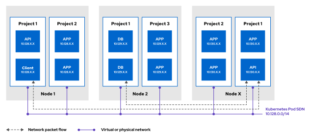
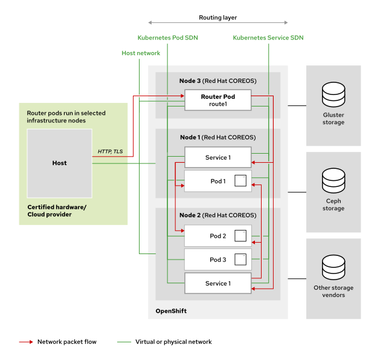
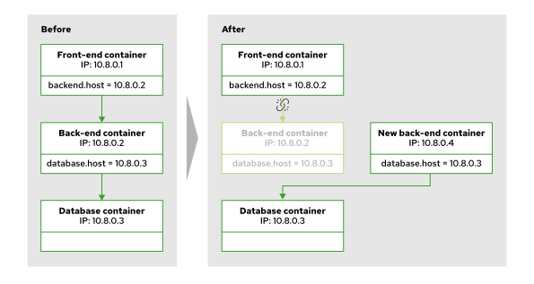
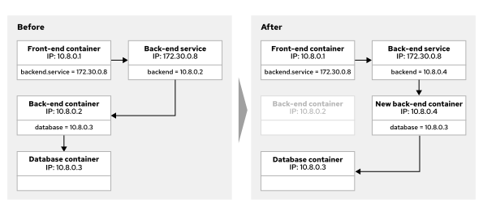
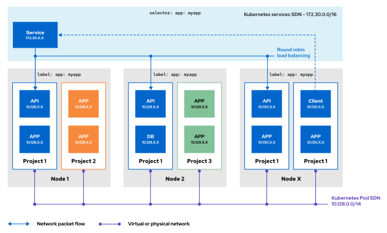
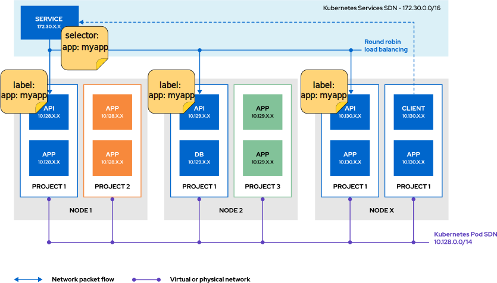
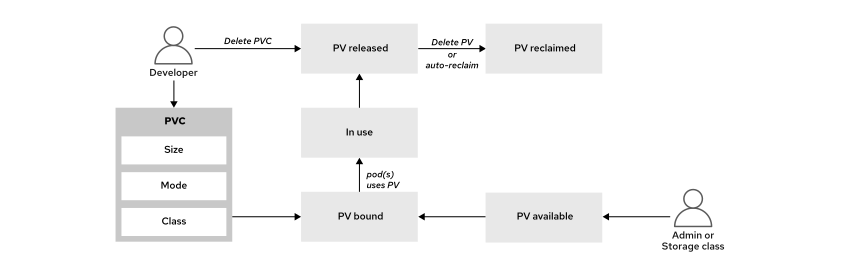

# OPENSHIFT

Part 2/3

## DEPLOY APPLICATIONS FROM AN IMAGE AND FROM A TEMPLATE

### Deploying Applications

Container-based infrastructures support most types of traditional and modern applications.

The application term can refer to a software system or to a service within it. Given this ambiguity,
it is clearer to refer directly to resources, services, and other components.

### Resources and Resource Definitions

Kubernetes manages applications (or services) as a collection of resources. The resources are pieces
in the cluster. When creating a resouce, the component does not get created at once. It is the cluster
that creates the component, you just request the creation of the resource and the cluster does it.

A *resource* type is a specific component type (such as a pod). Different default resource types exists
some overlap. OpenShoft incluseds Kubernetes resouces types and adds its own resource types. To add resource
types you create or import CRDs.

### Managing Resources

You can *add*, *view* or *edit* resouce types in different formats, commomly the Yaml format but also
JSON format.

You can *delete* resources in batch by using the label selector. You can also delete the project or namespace.

	'oc delete deployment -l app=my-app' -> "deployment.apps "my-app" deleted"
	Delete a resouce by its label

As with creating the deletion is not immediate but is a request to the cluster.

### Common Resource Types and Their Uses

- Templates  
	Like projects, templates is an addon from OpenShift. A Yaml manifest that contains parameterized
	of one or more resources. OpenShift profives predefined templates in the *openshift* namespace
	
	Using the *'oc process ...'* option you can process the template into a list of resources. It will
	replace values and generate resource definitions. To update or create the resource in the cluster
	you must use the *'oc apply ...'* command
	
		'oc process -f mysql-template.yaml -o yaml' ->
			apiVersion: v1
			items:
			- apiVersion: v1
			  kind: Secret
			  ...
			- apiVersion: v1
			  kind: Service
			  ...
			- apiVersion: v1
			  kind: PersistentVolumeClaim
			  ...
			- apiVersion: apps/v1
			  kind: Deployment
			  ...
		
		Process the "mysql-template.yaml" template file and generate 4 resource definitions
		
		'oc process -f mysql-template.yaml --parameters' ->
			NAME                    DESCRIPTION ...
			...
			MYSQL_USER              Username for MySQL user   ...
			MYSQL_PASSWORD          Password for the MySQL connection    ...
			MYSQL_ROOT_PASSWORD     Password for the MySQL root user.    ...
			MYSQL_DATABASE          Name of the MySQL database accessed. ...
			VOLUME_CAPACITY         Volume space available for data,     ...
		
		With the "--parameters" flag displays the parameters of the template, listing the parameters
		of the "mysql-template" file.

	In Openshift you can use templates with the *'oc new ...'* command

		'oc new-app --template mysql-persistent' ->
			--> Deploying template "db-app/mysql-persistent" to project db-app
			...
				 The following service(s) have been created in your project: mysql.

						Username: userQSL
						Password: pyf0yElPvFWYQQou
				   Database Name: sampledb
				  Connection URL: mysql://mysql:3306/
			...
				 * With parameters:
					* Memory Limit=512Mi
					* Namespace=openshift
					* Database Service Name=mysql
					* MySQL Connection Username=userQSL # generated
					* MySQL Connection Password=pyf0yElPvFWYQQou # generated
					* MySQL root user Password=HHbdurqWO5gAog2m # generated
					* MySQL Database Name=sampledb
					* Volume Capacity=1Gi
					* Version of MySQL Image=8.0-el8

			--> Creating resources ... #1
				secret "mysql" created
				service "mysql" created
				persistentvolumeclaim "mysql" created
				deployment.apps "mysql" created
			--> Success
			...
		
		Explain
		-----
		#1: Several resources are created to meet the requirements of the deployment, including a secret,
			a service, and a persistent volume claim.

		The *'new-app'* command uses the mysql-persistent template to create a MySQL application and
		its supporting resources.

	You are also able to use template, helm charts, builder images or devfiles to create applicaitons from
	the web console using the "Developers Catalog" page. As a "developer" go to "+Add" menu and click "All
	Service"  in the "Developer Catalog" section to open the catalog.

	Enter the applicaions name in the filter box to search for the applicaions template. Use a template
	and change its default values, Git repo, memory limits and applicaion version.

	It is also possible to create an applicaion from the "Topology" menu and by clicking "Start building
	applictaion" (clikc the book icon). 

- Pod  
	The smallest compute unit that can be defined, deployed and managed in OpenShift. A pod runs one
	or more containers that represent a single applicaion. Containers in a pod share resources such
	as network and storage.
	
		Example of a definition of a Pod
		-----
		apiVersion: v1
		kind: Pod #1
		metadata: #2
		  annotations: {}
		  labels:
			deployment: docker-registry-1
		  name: registry
		  namespace: pod-registries
		spec: #3
		  containers:
		  - env:
			- name: OPENSHIFT_CA_DATA
			  value:
			image: openshift/origin-docker-registry:v0.6.2
			imagePullPolicy: IfNotPresent
			name: registry
			ports:
			- containerPort: 5000
			  protocol: TCP
			resources: {}
			securityContext: {}
			volumeMounts:
			- mountPath: /registry
			  name: registry-storage
		  dnsPolicy: ClusterFirst
		  imagePullSecrets:
		  - name: default-dockercfg-at06w
		  restartPolicy: Always
		  serviceAccount: default
		  volumes:
		  - emptyDir: {}
			name: registry-storage
		status: #4
		  conditions: {}
		
		Explaination of the definition of a Pod
		-----
		#1: The resource kind is set to Pod.
		#2: Information that describes your application, such as the name, project, attached labels,
			and annotations.
		#3: Section where the application requirements are specified, such as the container name, the
			container image, environment variables, volume mounts, network configuration, and volumes.
		#4: Indicates the last condition of the pod, such as the last probe time, the last transition
			time, the status setting as true or false, and more.

- Deployments  
	A deployment is the intended state of a component of the applicaion as a pod template. A deployment
	manages one or more replica sets.
	
		Example of a definition of a Deployment
		-----
		apiVersion: apps/v1
		kind: Deployment #1
		metadata:
		  name: hello-openshift #2
		spec:
		  replicas: 1 #3
		  selector:
			matchLabels:
			  app: hello-openshift
		  template: #4
			metadata:
			  labels:
				app: hello-openshift
			spec:
			  containers:
			  - name: hello-openshift #5
				image: openshift/hello-openshift:latest #6
				ports: 7
				- containerPort: 80
		
		Explaination of the definition of a Deployment
		-----
		#1: The resource kind is set to Deployment.
		#2: Name of the deployment resource.
		#3: Number of running instances.
		#4: Section to define the metadata, labels, and the container information of the deployment
			resource.
		#5: Name of the container.
		#6: Resource of the image for creating the deployment resource.
		#7: Port configuration, such as the port number, the name of the port, and the protocol.

- Projects  
	OpenShift adds projects to enhance Kubernetes namespaces. A project is a Kuberneters namespace with
	additional annotations and it the primary way of managing access to resources for normal users. 
	A project can be created from a template and must use RBAC for organization and permission management.
	Administrators grants cluser users access to a project, if the sluseter users is allowed to create
	projects then the user automatially has access to their created projects.

	Projects provide logical and organizational isolation to separate your application component resources.
	Resources in one project can access resources in other projects, but not by default.

		Example of a definition of a Project
		-----
		apiVersion: project.openshift.io/v1
		kind: Project #1
		metadata:
		  name: test #2
		spec:
		  finalizers: #3
		  - kubernetes
		
		Explaination of the definition of a Project
		-----
		#1: The resource kind is set to Project.
		#2: Name of the project.
		#3: A finalizer is a special metadata key that tells Kubernetes to wait until a specific
			condition is met before it fully deletes a resource.

- Services  
	Using a servie internal pod to pod communation can be configured. An applicaion sends a request 
	to the service name and port. OpenShift provides virtual network that rerouytes requests to pods
	that the service targets by using labels.

		Example of a definition of a Service
		-----
		apiVersion: v1
		kind: Service #1
		metadata:
		  name: docker-registry #2
		  namespace: test #3
		spec:
		  selector:
			app: MyApp #4
		  ports:
		  - protocol: TCP #5
			port: 80 #6
			targetPort: 9376 #7
			
		Explaination of the definition of a Service
		-----
		#1: The resource kind is set to Service.
		#2: Name of the service.
		#3: Project name where the service resource exists.
		#4: The label selector identifies all pods with the attached app=MyApp label and adds the
			pods to the service endpoints.
		#5: Internet protocol is set to TCP.
		#6: Port that the service listens on.
		#7: Port on the backing pods, which the service forwards connections to.

- Persistent Volume Claims  
	OpenShift uses Kubernetes persistent volume (PV) to provision persistent storage for a cluster. 
	Developers can use persistent volumes claims (PVCs) to request PV resources without having knowledge
	of the underlying infrastructure. After a PV is bound a PVC that PV can not eb bound to additional
	PVCs. PVCs are namespaced objects and PVs are globally objects, a binding will therefore bind a PV
	to a namespaced until the binding is deleted.
	
		Example of a definition of a Persistent Volume Claims
		-----
		apiVersion: v1
		kind: PersistentVolumeClaim #1
		metadata:
		  name: mysql-pvc #2
		spec:
		  accessModes:
			- ReadWriteOnce #3
		  resources:
			requests:
			  storage: 1Gi #4
		  storageClassName: nfs-storage #5
		status: {}
			
		Explaination of the definition of a Persistent Volume Claims
		-----
		#1: The resource kind is set to PersistentVolumeClaim.
		#2: Name of the service.
		#3: The access mode, to define the read/write and mount permissions.
		#4: The storage of the PVC.
		#5: Name of the StorageClass that the claim requires.

- Secrets  
	Secrets hold sensitive information, such as passwords, credentials, special config files, ssh keys,
	... A secret is mounted in a containers by using a volume plugon. Secrets can store amy type of 
	data. OpenShift and Kubernetes supports different types of secrets such as service account tokens,
	SSH keys, and TLS certificates.

		Example of a definition of a Secret
		-----
		apiVersion: v1
		kind: Secret #1
		metadata:
		  name: example-secret #2
		  namespace: my-app #3
		type: Opaque #4
		data: #5
		  username: bXl1c2VyCg==
		  password: bXlQQDU1Cg==
		stringData: #6
		  hostname: myapp.mydomain.com
		  secret.properties: |
			property1=valueA
			property2=valueB
			
		Explaination of the definition of a Secret
		-----
		#1: The resource kind is set to Secret.
		#2: Name of the service.
		#3: Project name where the service resource exists.
		#4: Specifies the type of secret.
		#5: Specifies the encoded string and data.
		#6: Specifies the decoded string and data.

### Managing Resources from the Command Line

Openshift and Kubernets commands can create, modify or delete resources. Some commands are from Kubernetes
(core) and some are addons for OpenShift.

Resource management commands can be in two categories

- An *imperative* command instructs what the cluster does.
- A *declarative* command defines the state that the cluster attempts to match.

#### Imperative Resource Management

The *'create'* command is an *imperative* way of creating resources and is included in both the *'oc'*
and *'kubectl'* commands.

*Imperative* = give instruction to the cluster

	'oc create deployment my-app --image example.com/my-image:dev'
	Creates an Deployments named "my-app" that creates pod that are besed on a specific image
	
	'oc set env deployment/my-app TEAM=red'
	Use the 'set' option to define attributes on a resouces like environmental variables. In this
	case add the enciron,etal variable "TEAM=red# to a existing deployment named "my-app"
	
	Example using the 'run' option also an imperative approach to creating a resource
	-----
	'oc run example-pod \ #1
	 --image=registry.access.redhat.com/ubi8/httpd-24 \ #2
	 --env GREETING='Hello from the awesome container' \ #3
	 --port 8080' #4
 
 	Explain the usage of 'run' option
 	-----
 	#1: The pod .metadata.name definition
	#2: The image for the single container in this pod
	#3: The environment variable for the single container in this pod
	#4: The port metadata definition

The imperative way is a faster way of creating resources because som definition are not needed. Adding
versioning and incremental changes require declarative manifests.

Normally you test the deployment by doing it the imperative commands. You can use the imperative way
to deploy an applicaion to test it, adding the flag "--dry-run=client" avoids the creation of the object,
by adding the output flag, "-o yaml" or "-o json", with a format output

	'oc run example-pod \
	 --image=registry.access.redhat.com/ubi8/httpd-24 \
	 --env GREETING='Hello from the awesome container' \
	 --port 8080 \
	 --dry-run=client -o yaml' ->
	 
	apiVersion: v1
	kind: Pod
	metadata:
	  creationTimestamp: null
	  labels:
		run: example-pod
	  name: example-pod
	spec:
	  containers:
	...
	
	Generate a Yaml manifest file using the imperative way.

#### Declarative Resource Management

Using the 'create' option and providing a manifest where the resource is defined is declarative way.

	'oc create -f my-app-deployment.yaml' -> "deployment.apps/my-app created"
	The declarative way, using a manifest file container the resources

OpenShift adds the 'new-aåå' option which is another way of declarative way to create resouces. A way
to determin which types of resources to create based on the specified parameters.

	'oc new-app --file=./example/my-app.yaml' -> 
		...
		Creating resources ...
		imagestream.image.openshift.io "my-app" created
		deployment.apps "my-app" created
		services "my-app" created
		...
	
	Deploys the my-app application by creating several resources, including a deployment resource, from
	a YAML manifest file

In both 'cresate' and 'new-app' options you declare the intended state of the resources, what the state
should be when all have been deployed.

The 'new-app' option can be used with template for resource managemant. The template tells the intended
state of the resourcethat muste be created before for an applicaion to run, such as deployments and services.
Supplying the template using the 'new-app' option is a form of declarative resource management.

The 'new-app' options also includes flags such as "--param" that can customize an appliaction deployment
declarative. 

	'oc new-app --template mysql-persistent \
 --param MYSQL_USER=operator --param MYSQL_PASSWORD=myP@55 \
 --param MYSQL_DATABASE=mydata \
 --param DATABASE_SERVICE_NAME=db' ->
		Deploying template "db-app/mysql-persistent" to project db-app
		...
		The following service(s) have been created in your project: db.
		  Username: operator
		  Password: myP@55
		  Database Name: mydata
		  Connection URL: mysql://db:3306/
		...
		* With parameters:
		  * Memory Limit=512Mi
		  * Namespace=openshift
		  * Database Service Name=db
		  * MySQL Connection Username=operator
		  * MySQL Connection Password=myP@55
		  * MySQL root user Password=tlH8BThuVgnIrCon
		  ...
		Creating resources ...
		  secret "db" created
		  service "db" created
		  persistentvolumeclaim "db" created
		Success
		...

	When the 'new-app' is used with a template you can include the "--param" flag to override a parameter
	value in the template

Simular to the 'create' option you can use the 'new-app' flag imperatively. When using a conatiner image
with the 'new-app' you instruct the cluster what to do rather then declaring the intended outcome.

	'oc new-app --image example.com/my-app:dev' -> 
		...
		Creating resources ...
		imagestream.image.openshift.io "my-app" created
		deployment.apps "my-app" created
		...
		
	Deploys the "example.com/my-app:dev" imageby createing severla resources, including a deployment

You are also able to use a Git repository with the "new-app" command

	'oc new-app https://github.com/apache/httpd.git#2.4.56' ->
		...
		Creating resources ...
		imagestream.image.openshift.io "httpd24" created
		deployment.apps "httpd24" created
		...

	Create an application named "httpd24" by using a Git repository

### Retrieving Resource Information

You can supply all arguments to commands to specify a list of common resource types. But all options
does not inslude every reouse type. Instead all is a shorthand for a predefined subset of types. When you
use this command argument ensure that all includes any intended types to address.

You can get detailed information about a resource, such as defined parameter, by using the 'describe' option.

	'oc describe template mysql-ephemeral -n openshift' ->
		Name:		mysql-ephemeral
		Namespace:	openshift
		...
		Parameters:
		  Name:		MEMORY_LIMIT
		  Display Name:	Memory Limit
		  Description:	Maximum amount of memory the container can use.
		  Required:		true
		  Value:		512Mi

		  Name:		NAMESPACE
		  Display Name:	Namespace
		  Description:	The OpenShift Namespace where the ImageStream resides.
		  Required:		false
		  Value:		openshift
		  ...
		Objects:
		  Secret				                        ${DATABASE_SERVICE_NAME}
		  Service				                        ${DATABASE_SERVICE_NAME}
	
	OpenShift provides template int eh "openshift" project to use with the 'oc new-app' command.
	The above displays detailed infomration about the "mysql-ephemeral" template.

The 'oc describe' command can not generate a structured output like Yaml or JSON formats. A structured
format is required for the 'ic desrbie' command to parse or filter the output with tools auch as "JSONPath"
or "Go template". Instead use the 'oc get' command to generate and to parse the structured output of
a resource.

---

## MANAGE LONG-LIVED AND SHORT-LIVED APPLICATIONS BY USING THE KUBERNETS WORKLOAD API

### Kubernetes Workload Resources

The Kuberenetes workdloads API consists of resouces that represent various types of cluster tasks, such
as jobs and workloads, The Workload APIs is composed of various Kubernetes APIs and extensions that simplify the
deployment and management of applications.

Workload API resource types that are ofter used

- Jobs
- CronJobs
- Deployments
- DeamonSets
- StatefulSets

#### Jobs

A *job* resource is a ont-task* to peform on the cluster, jobs are executed as pods. If the job's pod
fails then the cluster retries a number of times that the job defines. If the job succeed it will not
restart.

A *job* differ from using the *'oc run'* command that only creates a pod. The pod is not managed by
high-level controllerar. If the node where the pod is running fails the pod will not be rescheduled, the
pod is not automatically resytarted if its process exists with an error code.

Common uses for jobs

- Initializing or migrating a database
- Calculating one-off metrics from information within the cluster
- Creating or restoring from a data backup

	Example of a command creates a job that logs the date and time
	-----
	'oc create job \ #1
	date-job \ #2
	--image registry.access.redhat.com/ubi9/ubi \ #3
	-- /bin/bash -c "date"' #4
	
	Explanation for the job command
	-----
	#1: Creates a job resource.
	#2: Specifies a job name of date-job.
	#3: Sets registry.access.redhat.com/ubi9/ubi as the container image for the job pods.
	#4: Specifies the command to run within the pods.

A job can also be created in the OpenShift web console in "Workloads -> Jobs", then click "Create Jobs"
to customize the Yaml manifest.

 
#### Cron Jobs

A *cron job* resource builds a regilare job by specifing of often the job should be run. *Cron jobs* are
useful to create periodic jobs that reoccur, such as backupjobs or report generation. Cron jobs also
schedule individual tasks for a specific time, when there is low activity period. Simulare to the crontab
on Linux system the CronJob resource uses Cron format to schedule cron jobs. A cronJob resource creates
a Job resource based on the time zone configureed on the control plane node that runs the cron job controller.

In OpenShift you specify the time zone for cronjobs schedule to ensure correct timing regardless of
the nodes locations.

	Example of a command creating a cronjob that prints the system time every minute
	-----
	'oc create cronjob date-cronjob \ #1
	--image registry.access.redhat.com/ubi9/ubi \ #2
	--schedule "*/1 * * * *" \ #3
	-- date' #4
	
	Explanation for the cronjob command
	-----
	#1: Creates a cron job resource with a name of date-cronjob.
	#2: Sets the registry.access.redhat.com/ubi9/ubi as the container image for the job pods.
	#3: Specifies the schedule for the job in Cron format.
	#4: The command to execute within the pods.

A cronjob can alos be created using the OpenShift web console, "Workloads -> CronJobs" menu and click
"Create CronJob" to customize the Yaml manifest.

#### Deployments

A deployment creates a *replica set* to maintain pods. A *Replica set* maintain the specific number of
replicas of a pod. Replicasets uses selectors, labels to identify pods that are part of the set. Pods
are created or removed until the replicas reached the number that the deployment specifies. Replica 
sets are not managed directly but throuugh deployments that indirectly manage replica set.

Unlike a Job deployment's pods are re-created after a creash or deletions, because of the usage of replica
sets.

	Example of a command creating a deployment (which contains a replica set)
	-----
	'oc create deployment \ #1
	my-deployment \ #2
	--image registry.access.redhat.com/ubi9/ubi \ #3
	--replicas 3 #4
	
	Explanation for the deployment command
	-----
	#1: Creates a deployment resource.
	#2: Specifies my-deployment as the deployment name.
	#3: Sets registry.access.redhat.com/ubi9/ubi as the container image for the pods.
	#4: Sets the deployment to maintain three instances of the pod.

OpensShift web console can create a deployment, "Workloads -> Deployments" menu and click "Create Deployment"
and customize the form or Yaml manifest.

Pods in a replica set are identified and match the pod template in the replica set definition. If the
number is not met then an new pod gets deleted or created.

Labels are a type of resource metadata that are reprented as sting key-value pair. A label indicates a
common trait from resources with that label. AS an exaple you might attach "layer=frontend" to resources
that relates to an applicaions UI component.

Many 'oc' commands accepts a lable to filter affected resources.

	'oc delete pod -l environment=testing'
	Deleting all pod with the label "environment=testing"

By applying labels to resources you can easy cross-referance resources and craft precise selectors.
A selector us a query object that describes the attributesof matchning resources.

Certain resources us selectors to find other resources

	Example of a replica set that uses selecotsor to match its pods.
	-----
	apiVersion: apps/v1
	kind: ReplicaSet
	...
	spec:
	  replicas: 1
	  selector:
		matchLabels:
		  app: httpd
		  pod-template-hash: 7c84fbdb57
	...

#### Daemonsets

A daemon sets ensures that all or some nodes run a copy of a pod. As nodes are added to the cluster pods
are added to them. As nodes are removed from the cluster, those pods are garbage collected. Delete the
daemon set to clean up the pods it created.

Common uses for daemon sets inslude running storage daemons, lg collectors or monitoring agents on every
node.

	Example of a command creating a daemin set
	-----
	'oc create daemonset my-daemonset \ 1
--image registry.access.redhat.com/ubi9/ubi' #2
	
	Explanation for the daemon set command
	-----
	#1: Creates a daemon set resource.
	#2: Sets registry.access.redhat.com/ubi9/ubi as the container image for the pods.

A daemon set can also be created in OpenShift web console, "Workloads -> DaemonSets". Click "Create DaemonSet"
and customize the Yaml manifest.

#### Stateful Sets

Like deployments, stateful sets manages a set of pods based on the container specifications. But each
pod that are created by the stateful set is unique. Pod uniqueness is useful when a pod needs a unique
network identifier or persistent storage.

As their names implies stateful sets are for pods that require a state within the cluster.
Deployment are used for stateless pods.

---

## KUBERNETES POD and SERVICE NETWORKS

### The Software-defined Network

Kubernetes uses software-defined networking (SDN) by Open Virtual Network (OVN) Kubernetes to manages
the network infrastructure of the cluster. OVN-Kubernetes creates an virtual network that includes all
cluster nodes. The virtual network enables communication between any container or pod within the cluster.
Cluster node processes that Kubernetes pods manage have access to the OVN-Kubernetes network. But the
OVN-Kubernetes network is not accessible from outside of the cluster or by regular processes on cluster
nodes.

Using the OVN-Kubernetes model you can manage network service through the abstraction of multiple layers.
Upi can also managenetwork traffic and network resources programmatically the enable orginization teams
to determine how to expose their applications.

The OVN-Kubernetes implementation creates a model that is compatible with traditional networking practices.
The model makes pods that are similar to virtual machines in terms of port allocation, IP address leasing,
and reservation.

With OVN-Kubernetes design  you do not need to modify how applications components communicate with each
other. The OVN-Kubernetes design assists in containerizing legacy applications. If your application
consists of multiple services that communicate over the TCP/UDP stack, then this approach remains
effective because containers within a pod use the same network stack.

The following diagram illustrates how all pods connect to a shared network:

Among the features of OVN-Kubernetes, open standards enable vendors to propose solutions for centralized
management, dynamic routing, and tenant isolation.

### Kubernetes Networking

In Kubernetes networking gives an scalable method for communication between containers and offers the
following.

- Highly coupled container-to-container communications
- Pod-to-pod communications
- Pod-to-service communications
- External-to-service communication

Kubernetes automatically assigns IPs to each pod. The IPs are only valid during the life of the pod.
Pods gets created and deleted across the cluster. An example would be when you role out a new version
of the application that exists in multiple pods. Kubernetes will deploy new pods to replace the old ones.

All containers within a pod share network resources (and storage resources). The IP and MAC address that
are assigned to the pod are shared among all containers in the pod. This gives that every container can
access each other ports using loopback, *localhost*. Ports that are bound to localhost are available to
all containers within the pod but not to anyone outside of the pod.

Default pods are able to communicate with each other even if they run on different cluster nodes or
belong to different Kubernetes namespace. Every pod is assigned an IP address in a flat shared networking
namespace. that has full communication with other physical computers and containers acress the network.
All pods are assigned an unique IP address from a Classless Inter-Domain Routing (CIDR) range of host
addresses. The shared address range places all pods in the same subnet.

When all pods are on the same subnet pods on all nodes can communicate with pods on any other node without
the help of Network Address Translation (NAT). Kubernetes also provides a service subnet which links
the stable IP addresses of a service resource to a set of specific pods. The traffic is forwarded in
a transparent way to the pods, an agnent, which OVN-Kubernetes manages, handeles routing rules to direct
traffic to pods that match the service resource selectors. Pods functions more like virteual machines
or to physical hosts when it comes to port allocation, networking, naming, service discovery, load balancing,
application configuration and migration.

The following illustration gives further insight into how the infrastructure components work along with
the pod and service subnets to enable network access between pods inside an OpenShift instance.

The shared networking namespace pf pods enables a straightforward communication model. But the dynamic
nature of pods is a problem. Pods can be added (scaled up) on the fly to handle more traffic and pods
can also be removed (scaled down). If a pod fails Kubernets automatically replaces the pod with a new
one. These events changes the IP addresses of the pods.

In the above picture the "before" shows a fron-end container that is running in a pod with IP 10.8.0.1.
The container also shows a back-end container that is running in a pod with IP 10.8.0.2. Something happens
to the back-end container causes it to fail. In response to the pod failing Kubernetes now creates a
new pod to replace the nack-end container but the new pod gets a new IP 10.8.0.4.

In the above picture the "after"  the front-end container now has an invalid refrence to the back-end
container because of the IP change. Kubernetes resolves this problem with service resources.

### Using Services

Container inside pods must not directly connect to each oters dynamic Ips. Instead Kubernetes assigns
a stable IP address to a serice resource that is linked to a set od specified pods. The service acts
as a virtual network load balancer for the pods that are linked to it.

If pods are restarted, replicated or rescheduled to a different nodes the the service endpoints are
updated. The updated endpoints provide scalability and fault tolerance for the application. Unlike IPs
for pods the IPs for services do not change. Service stability provides scalability and fault tolerance
for the application.

In the above picture the "before" shows that a front-end reference a spable IP of the back-end service,
instead of the IP of the back-end container. When the back-end container fails a new back-end container
will be created by Kubernetes to replace the failed pod. In response to the change Kubernetes removes 
the failed pod from the service endpoints. Kubernetes then adds the Ip of the new back-end pod to the
service endpoints.

With the service requests from the fron-end container to the back-end container keeps working. The service
dynamically updates with the IP chnage. A service provides a permanent statis IP address for a group of
pods that belong to the same deployment or replica set for an applicaion. Until it is deleted the assigned
IP will not chnage and the cluster does not reuse it.

Most application do not run as a single pod. Applications needs to scale horizontally. Multiple pods
run the same container to meet growing user demand. A deployment resource manages multiple pods that
runs the same container. A service provide a single IP address for the entire set. The service performs
load balancing for client requests among member pods.

With services, containers in a pod can establish network connections to containers in other pod. The pods
that the service tracks do not need to exists on the same compute node or in the same namespace or project.
Because a service provides a stable IP address for other pods to use a pod does not need to discover
the new IP address for another pod after a restart. The service provides a stable IP address to use no
matter which compute node runs the pod after restart.

The service object provides a stable IP address for the client container on "Node X" The stable IP address
enables the client to send request to any of the API containers.

Kubernets uses labels on pods to select those pods that are associated with a service. To include a pod
in a service the pod labels must include each of the selector fields of the service.

In the above example the selector has a key-value pair "app: myapp". The pods with a matching label of
"app: myapp" are included in the set that are associated with the service. The selector attribute of
a service identifies the set of pods that from the endpoints for the service. Each pod in the set is an
endpoint for the service.

To create a service for a deployment use the 'expose' option.

	'oc expose deployment/<deployment-name> [--selector <selector>]
	[--port <port>][--target-port <target port>][--protocol <protocol>][--name <name>]'
	
The 'oc expose' uses the "--selector" flag to specify label selecors. When it is omitted a selector that
matches the replication controller or replica set is used. 

The "--port" flag specifies the port that the service listens on. This port is availbe only to pods	within
the cluster. If a port is not provided the the port is copied from the configuration of the deployment.

The "--target-port" flag specifies the name or number of the container port that the service uses to
communicate with the pods. If a port value is not provided the the port is copied from the configuration
of the deployment.

The "--protocol" flag determin the network protocol for the serveice, TCP is used by default.

The "--name" flag names the service, if no name is provided then the service usesthe same name as the
deployment.

	'oc get service db-pod -o wide' ->
		NAME    TYPE        CLUSTER-IP      EXTERNAL-IP PORT(S)     AGE     SELECTOR
		db-pod  ClusterIP   172.30.108.92   <none>      3306/TCP    108s    app=db-pod
	
	To view the selector for a servie you must use the wide output.
	
	'oc get endpoints' -> 
		NAME     ENDPOINTS                       AGE
		db-pod   10.8.0.86:3306,10.8.0.88:3306   27s
	
	See the endpoints that a service uses.	
	The name of the service is "db-pod" and pods must use "app=db-pod" label (see above) to be included
	in the host list for the "db-pod" service
	
	'oc describe deployment db-pod' ->
		Name:                   db-pod
		Namespace:              deploy-services
		CreationTimestamp:      Wed, 18 Jan 2023 17:46:03 -0500
		Labels:                 app=db-pod
		Annotations:            deployment.kubernetes.io/revision: 2
		Selector:               app=db-pod
		...
	
	To see the deployment selector use 'oc describe deployment ...'
	
	'oc get deployment/db-pod -o yaml'
		...
		  selector:
		    matchLabels:
		      app: db-pod
		...
	
	To get the output in Yaml format and the deployment resource from the spec.selector.matchLabels object.

### Kubernetes DNS for Service Discovery

Kubernetes uses an Internal Domain Name System (DNS) server that the DNS operator deploys. The DNS operator
creates a default cluster DNS name and assigns DNS names to services that are defined. The DNS operator
implements the DNS API from the operator.openshift.io API group. The operator deploys CoreDNS, creates
the service for CoreDNS and configures the kubelet component to instruct pods pods to use the CoreDNS
service IP address for name resolution. When a service does not have a cluster IP the DNS operator assigns
a DNS record that resolves to the set of IP addresses of the pods behind the service.

The DNS server discovers a service from a pod by using the internal DNS server that are only visable
for pods. Each service is dynamically assigned a Fully Qualified Domain Name (FQDN) that uses the format:
"SVC-NAME.PROJECT-NAME.svc.CLUSTER-DOMAIN"

	'cat /etc/resolv.conf' ->
		nameserver 172.30.0.10
		search deploy-services.svc.cluster.local svc.cluster.local cluster.local
		options ndots:5

	When a pod is created Kubernetes provides the resolv.conf file.
	"deploy-services" is the project name for the pod
	"cluster.local" is the cluster domain

The nameserver directive provides the IP address of the Kubernerts internal DNS server. The "options ndots"
specifies the number of dots that must be in a name to qualify for an initial absolute query. Alternative
hostname values are derived by appending values from the search directive to the name that you send 
to the DNS server.

In the "search" directive the "svc.cluster.local" enables any pod to communicate with another pod using
the service name and project name, "SVC-NAME.PROJECT-NAME".

The first entry in the "search" directive enables a pod to use the service name to specify another pod
in the same project. In OpenShift a project is also a namespace for a pod. The service name alone is
enough for pods in the same project, "SVC-NAME"

### Kubernetes Networking Drivers

Container Network Interface (CNI) plugins gives a common interface between the network provider and 
the container runtime. CNI defines the specifications for plugins that configure network interfaces
inside containers. Plugins are written to the specification enable different network providers to control
the OpenShoft cluster network.

Red Hat provides the following CNI plug-ins for a RHOCP cluster

- OVN-Kubernetes: The default plug-in for first-time installations of RHOCP 4.10 and later versions.
- OpenShift SDN: An earlier plug-in from RHOCP 3.x; it is incompatible with some later features of RHOCP 4.x.

Certified CNI plugins from other vendors are also complatiable with OpenShift cluster.

The SDN uses CNI plugin to create Linux namespaces to partition the usage of resources and processes 
on virtual and physical hosts. With the implementation containers inside pods can share resources such
as devices, IP stacks, firewall rules and routing table. The SDN provide a unique routable IP to each
pod so the pod is accessable from any oter service in the same network.

In OpenShift 4.18, OVN-Kubernetes serves as the default network provider and OpenShift SDN is deprecated.

OVN-Kubernetes uses OVN to manage the cluster network. A cluster that uses the OVN-Kubernetes plugins
also runs Open vSwitch (OVS) on each node. OVN configures OVS on each node to implement the declared
network configuration.

#### The OpenShift Cluster Network Operator

OpenShift provide a Cluster Network Operator (CNO) that configures OpenShift cluster networking. The CNO
serves as an OpenShift cluster operator that loads and configures CNI plugins.

	'oc get -n openshift-network-operator deployment/network-operator' ->
		NAME              READY   UP-TO-DATE  AVAILABLE   AGE
		network-operator  1/1     1           1           41d
		
	As a cluster admin you can observe the status of the CNO

An administrator configures the CNO at installation time

	'oc describe network.config/cluster' ->
		Name: cluster
		...
		Spec:
		  Cluster Network:
		  Cidr: 10.128.0.0/14 #1
		  Host Prefix: 23
		  External IP:
		    Policy:
		      Network Type: OVNKubernetes
		      Service Network:
		        172.30.0.0/16 #2
	
	Explain the output from the abobe command
	-----
	#1: The Cluster Network CIDR defines the range of IP addresses for all pods in the cluster.
	#2: The Service Network CIDR defines the range of IP addresses for all services in the cluster.
	
	Use the above command to view the configuration.

---

## SCALE AND EXPOSE APPLICATIONS TO EXTERNAL ACCESS

### IP Addresses for Pods and Services

Application might need multiple pods to scale horixintally to meet growing demands. OpenShift deploys
many pods with the same conytainer from a single pod resource definition. A service resource defines a
single IP and port combination. The resource assign a single IP to the stable IP ta a pool of pods.
The resource balances client request to all pods.

OpenShift assigns each service an unique IP for client to connect to. Round-Robin is used for load balancing.
The service IP comes from internal OVN-Kubernetes network which is seperate from the podntwork and only
accessible to pods within the cluster. OpenShift adds each pod to match the selecor of the service as an endpoint.

### Service types

OpenShift offers several different service types to mmet the needs of an applicaion, cluster infrastructure
and security requirements.

- ClusterIP  
	The ClusterIP type which is the default type. Assigns a cluster internal IP to a service. The assignment
	makes the service accessible only within the cluster.
	
	ClusterIP service ebales pod to pod communication. OpenShift gets Ips from a dedicated service network.
	The network accessable only inside of the network supports internal communication. Kubernetes automates
	management of the service.
	
- LoadBalancer  
	The LoadBalancer type OpenShift to provision a load balancer of the cloud provider. An external accessible
	IP is assigned to provide access to the applicaion.
	
	When deploying a LoadBalancer services a cost will occur when assigning the service to every applicaion.
	The service are exposing applicaions to external networks. Additional security configuration is required
	to prevent unauthorized access.
	
- ExternalIP  
	The ExternalIp service redirect traffic from the virtual IP address on a cluster node to a pod. A 
	cluster administrator assigns the virtual IP address to the node and confifures failover to another
	node if needed.
	
	OpenShift configure NAT rules to route traffic from the virtual address to the pod. Administrators
	must make sure that the external IP is routed to the node. Additional security measures protect 
	the cluster from external access.
	
	WARNING!!!  
	Starting with RHOCP 4.18, ExternalIP is a legacy feature due to security concerns. Direct network
	connections to cluster nodes, which this service requires, conflict with most security policies.
	Use the LoadBalancer or the NodePort type unless the ExternalIP type meets specific requirements.
	
- NodePort  
	Exposes service exposes a service on a specific port, default range 30000-32767 on the IP of each
	cluster node. Each node redirect traffic from this port to the endpoints of the service.
	
	WARNING!!!  
	NodePort services require direct network connections to cluster nodes, which poses a security risk.
	Implement strict firewall rules and access controls to mitigate risks.
	
- ExternalName  
	The ExternalName service map a Kubernetes service to an external DNS name that is soecified in the
	"externalName" field. The Kubernetes DNS server return the EexternalName" in a CNAME record. The
	record directs clients to resolve the external name to an IP address.

### Using Routes for External Connectivity

OpenShift provides *Route* resources to expose applications to external networks. A route resource supports
HTTP, HTTPS, TCP an oter protcols. It prioritize HTTP and TLS based applicaions for external exposure.
None HTTP applicaions such as databases typically remains internal. *Route* and *Ingress* resources handle
ingress traffic i OpenShift.

A *Route* resource assigns a public accessible hostnmae to an application. The OpenShoft ingress controller, 
HAProxy based, redirect traffic from a public IP address to pods. The OpenShift ingress controller is 
the default but support for third-party ingress controllers that are deployed in parallel. *Route* resources
offer advanced features that is better then Kubernetes I*Ingress* capabilities. Features include TLS 
re-encryption, passthrough and split traffic for blue-gree deployments.

	'oc expose service api-frontend --hostname api.apps.acme.com'
	Create a route using the oc CLI
	
	The "--target-port" flag with the 'oc expose' command specifies the name or number of the port container
	that is uses to communicate with the pods. If no port value is provided then the port is copied
	from the deployment

	Not using "--hostname" flag makes OpenShift to generate a hostname in
	"<route-name>-<project-name>.<default-domain>" format, a "frontend" route in an "api" project with a 
	wildcard domains of "apps.example.com" becomes " frontend-api.apps.example.com".

IMPORTANT!!!  
The DNS server for the wildcard domain resolves all names to configured IPs. The server does not recognize
specific route hostnames. The OpenShift ingress controller treats route hostnames as HTTP virtual hosts.
Invalid or non-existent route hostnames trigger an HTTP 503 error.

To create a route configure the following steps

1. Service Name: Specifies the service to determine target pods.
1. Hostname: Sets the route hostname as a subdomain of the cluster wildcard domain, which RHOCP can autogenerate.
1. Path: Defines an optional path for path-based routing.
1. Target Port: Matches the targetPort in the service, and specifies the listening port of the application.
1. Encryption Strategy: Chooses secure (TLS) or insecure routing.

	An examplr of a minimal route definition
	-----
	kind: Route
	apiVersion: route.openshift.io/v1
	metadata:
	  name: a-simple-route #1
	  labels: #2
		app: API
		name: api-frontend
	spec:
	  host: api.apps.acme.com #3
	  to:
		kind: Service
		name: api-frontend #4
	  port:
		targetPort: 8443 #5
		
	Explaination to the route definition
	-----
	#1: Specifies a unique route name.
	#2: Defines selectors for the route.
	#3: Sets the hostname, which is a subdomain of the cluster wildcard domain.
	#4: Identifies the service to redirect traffic to, by determining target pods.
	#5: Maps the router port to the endpoint port of the service.

NOTE!!!
Some ecosystem components integrate with Ingress resources but not with Route resources. Starting with
RHOCP 4.18, creating an Ingress object automatically generates a managed Route object, which is deleted
when the Ingress object is removed.

	'oc delete route a-simple-route'
	To delete route

It is also possible to create a route using OpenShift web console. "Networking -> Routes", click "Create Route"
customize the name, hostname, path and target service.

### Using Ingress Objects for External Connectivity

A Kubernetes *Ingress* reource provides a simular function as the OpenShift route resouce. It supports
HTTP, HTTPS, Server Name Indication (SNI) and TLS with SNI. The OpenShift ingress controller processes
Ingress objects and enables features such as TLS temination, path redirect and sticky sessions.

NOTE!!!  
Note
Although Ingress resources are standard in Kubernetes, Route resources are preferred for advanced features
and native integration with the OpenShift ingress controller.

	'oc create ingress ingr-sakila --rule="ingr-sakila.apps.ocp4.example.com/*=sakila-service:8080"'
	Create an Ingress object
	
	Example of a minimal Ingress definition
	-----
	apiVersion: networking.k8s.io/v1
	kind: Ingress
	metadata:
	  name: frontend #1
	spec:
	  rules:
	  - host: www.example.com #2
		http:
		  paths:
		  - path: /
		    pathType: Prefix
		    backend:
		      service:
		        name: frontend #3
		        port:
		          number: 80 #4
	  tls:
	  - hosts:
		- www.example.com
		secretName: example-com-tls-certificate #5
	
	Explanation of the minimal Ingress definition
	-----
	#1: Specifies a unique name for the Ingress object.
	#2: Sets the hostname for inbound traffic.
	#3: Identifies the service to redirect traffic to.
	#4: Defines the port for the service back end.
	#5: Configures TLS for secure paths, which requires a matching host and a certificate secret.
	
	'oc delete ingress frontend'
	Delete an Ingress object

### Sticky Sessions

A sticky session ensures that a stateless applicaions traffic reaches the same pod for a session. The
OpenShift ingress controller can use cokkies to manage session persistence for Route and Ingress resources.
The controller selects a pod for the session, the controller generates the cookie, the controller includes
the cookie in the response, tehe clients sends the cookie with subsequent requests which enables the
controller to route traffic to the same pod.

	'oc annotate ingress ingr-example ingress.kubernetes.io/affinity=cookie'
	To configure session persistence for an Ingress object by using a cookie
	
	'oc annotate route route-example router.openshift.io/cookie_name=myapp'
	To configure session persistence for a Route object with a custom cookie named myapp
	
	'ROUTE_NAME=$(oc get route route-example -o jsonpath='{.spec.host}')'
	To capture the route hostname
	
	'curl $ROUTE_NAME -k -c /tmp/cookie_jar'
	To access the route and save the cookie
	
	'curl $ROUTE_NAME -k -b /tmp/cookie_jar'
	To use the saved cookie for subsequent requests, use the following command:

Using the saved cookie ensures that requests reach the same pod.

NOTE!!!  
Cookies cannot be set on passthrough routes because the HTTP traffic is encrypted, and the router does
not terminate TLS or read the contents of the request.

### Load Balance and Scale Applications

Administrators and developers can scale the number of replicas in development to handle traffic surges
or to conserve resources.

	'oc scale --replicas=5 deployment/scale'
	To scale a deployment, increaste of decrease the number of pods to 5

The deployment updates the replica set. The replica set creates or deletes pods to match the intended
replica count.

Avoid modifying a replica set directly, because the deployment controller manages these changes.

#### Load Balance Pods

A kubernetes Service resource functions as a internal load balancer by providing access to a workload
via the service name. The service distributes incomming connections across all replicated pods. The OpenShift
 controller uses the selector of the service to identify the service and endpoints. When both the controller
 and a service provide load balancing OpenShift relies on the controller to direct traffic to pods.
 The controller detects chnages in IPs of the service, the controller update the configuration. Custom
 controllers can propagate API object chnages to external solutions.

The OpenShift ingress controller maps external hostnames. The controller balances service endpoints
over protocols that include distinguishing information, such as HTTP host headers.

---

## EXTERNALIZE THE CONFIGURATION OF APPLICATIONS

### Configuring Kubernetes Applications

Running an application in Kubernetes from an image it uses the applications default configuration. This
configuration might not be valid for production and might be needed to be customized before production.

With Kubernets you can use JSON or Yamal formats to specify the manifest for each applicaion, the name,
labels, image source, storage, environmental variables, ...

	Example of a Yaml manifest for a deployment
	-----
	apiVersion: apps/v1 #1
	kind: Deployment #2
	metadata: #3
	  name: hello-deployment
	spec: #4
	  replicas: 1
	  selector:
		matchLabels:
		  app: hello-deployment
	  template:
		metadata:
		  labels:
		    app: hello-deployment
		spec: #5
		  containers:
		  - env: #6
		    - name: ENV_VARIABLE_1
		      valueFrom:
		        secretKeyRef:
		          key: hello
		          name: world
		    image: quay.io/hello-image:latest

	Explanation for the deployment manifest
	-----
	#1: API version of the resource.
	#2: Deployment resource type.
	#3: In this section, you specify the metadata of your application, such as the name.
	#4: You can define the general configuration of the resource that is applied to the deployment,
		such as the number of replicas (pods), the selector label, and the template data.
	#5: In this section, you specify the configuration for your application, such as the image name,
		the container name, ports, environment variables, and more.
	#6: You can define the environment variables to configure your application needs.

In some cases an applicaion may need combination of things to work in production. A database might 
have to be present for the application to be able to run. A combination of environmental values, external
files or command line arguments might be needed to the applicaion to run proper in production. These
different ways are to ensure that the applicaion is portable and able to run.

Kuberneters provides help with the configuration of the application by using configuration maps and
secrets.

Configuration maps can be injected into containers with configuration data. The *ConfigMap* (configuration
map) namespaced object gives a way to inject data into running container instances. The ConfigMap do
not require protection.

	Example of a Configuration map manifest
	-----
	apiVersion: v1
	kind: ConfigMap #1
	metadata:
	  name: example-configmap
	  namespace: my-app
	data: #2
	  example.property.1: hello
	  example.property.2: world
	  example.property.file: |-
		property.1=value-1
		property.2=value-2
		property.3=value-3
	binaryData: #3
	  bar: R0lGODlhAgACAIABAO4AAP///yH5BAEHAAEALAAAAAACAAIAAAIDRAIFADs=

	Explaination of the configuration map
	-----
	#1: ConfigMap resource type.
	#2: Contains the configuration data.
	#3: Points to an encoded file in base64 that contains non-UTF-8 data, for example, a binary Java
		keystore file. Place a key followed by the encoded file.

Application that require information of a sensitive nature like use *secrets* in Kubernetes and OpenShift.

Types of data that warrent using *secrets*, passwords, sensitive configuration files, credentials to
external resources like SSH keys or OAuth token, ...

	Example of a secret manifest
	-----
	apiVersion: v1
	kind: Secret
	metadata:
	  name: example-secret
	  namespace: my-app
	type: Opaque #1
	data: #2
	  username: bXl1c2VyCg==
	  password: bXlQQDU1Cg==
	stringData: #3
	  hostname: myapp.mydomain.com
	  secret.properties: |
		property1=valueA
		property2=valueB
		
	Explaination of the secret
	-----
	#1: Specifies the type of secret.
	#2: Specifies the encoded string and data.
	#3: Specifies the decoded string and data.

A secret is a namespaced object and it can store any type of data.The data is Base64 encoded and not
stored in plain text. The secret is not encrypted only encoden so it can be decoded from Base64 inside
the running container instance.

	Encode
	'SECRET=$(echo secretpassword | base64)'
	
	'echo ${SECRET}' -> c2VjcmV0cGFzc3dvcmQK
	
	Decode
	echo ${SECRET} | base64 --decode -> secretpassword

In Kubernetes and OpenShift the following types of secrets are supported

- Opaque secrets: An opaque secret store key and value pairs that contain arbitrary values, and are 
	not validated to conform to any convention for key names or values.

- Service account tokens: Store a token credential for applications that authenticate to the Kubernetes
	 API.

- Basic authentication secrets: Store the needed credentials for basic authentication. The data parameter
	 of the secret object must contain the user and the password keys that are encoded in the Base64
	 format.

- SSH keys: Store data that is used for SSH authentication.

- TLS certificates: Store a certificate and a key that are used for TLS.

- Docker configuration secrets: Store the credentials for accessing a container image registry.

When storing data in a specific secret resource type, Kubernetes will validate so the data conform to
the secret type.

NOTE!!!
By default, configuration maps and secrets are not encrypted. To encrypt your secret data at rest, you
must encrypt the Etcd database. When enabled, Etcd encrypts the following resources: secrets, 
configuration maps, routes, OAuth access tokens, and OAuth authorization tokens.

### Creating Secrets

A secret needs to be created before the deployment of a pod. Both the 'oc' and 'kubectl' CLI tools provide
the *'create secret' command.

Ways of creating a secret

- Creating a generic secret that contains a key-value pair typed from the CLI

		'oc create secret generic secret_name --from-literal key1=secret1 --from-literal key2=secret2'

- Creating a generic secret by using key names from the CLI but the values from files

		'kubectl create secret generic ssh-keys --from-file id_rsa=/path-to/id_rsa --from-file id_rsa.pub=/path-to/id_rsa.pub'

- Create a TLS secret that specifies a certificate and associated key

		'oc create secret tls secret-tls --cert /path-to-certificate --key /path-to-key'

To create an opaque secret from the OpenShift web console use "Workloads -> Secret" and click "Create"
and select "Key/value secret". Fill out the form and specify the value.

To create a secret in the web console to store credentials for a container image registry, click "Workloads -> Secrets" 
then "Create" and select "image pull secret", complete the form.

### Creating Configuration Maps

The syntax for creating a configuration maps and a secret are a close match. You can enter a key-value
pair or use the content of a file as the value for a key.

	'kubectl create configmap my-config --from-literal key1=config1 --from-literal key2=config2'
	Creating a configuration map named "my-config"
	
	'oc create cm my-config --from-literal key1=config1 --from-literal key2=config2'
	Using the shorthand 'cm' to create the configMap resource.

To create a configuration map from the web console use "Workloads -> ConfigMats", click "Create ConfigMaps"
and complete the configuration map by using the form or Yaml view.

NOTE!!!  
Use a binary data key instead of a data key if the file uses the binary format, such as a PNG file.

### Using Configuration Maps and Secrets to Initialize Environment Variables

A configMap can be used for indivitual environmental varaibles that configure the application.

	Example initialization of a ConfigMap of environmental variables
	-----
	apiVersion: v1
	kind: ConfigMap
	metadata:
	  name: config-map-example
	  namespace: example-app #1
	data:
	  database.name: sakila #2
	  database.user: redhat #3
	
	Explaination to the initialization
	-----
	#1: The project where the configuration map resides. ConfigMap objects can be referenced only by
		pods in the same project.
	#2: Initializes the database.name variable to the sakila value.
	#3: Initializes the database.user variable to the redhat value.

	After the initialization of the ConfigMap you can use it for environmental varaibles for the application.
	
	Example of a pod resource that uses the configMap for specific environmental variables
	-----
	apiVersion: v1
	kind: Pod
	metadata:
	  name: config-map-example-pod
	  namespace: example-app #0
	spec:
	  containers:
		- name: example-container
		  image: registry.example.com/mysql-80:1-237
		  command: [ "/bin/sh", "-c", "env" ]
		  env: #1
		    - name: MYSQL_DATABASE #2
		      valueFrom:
		        configMapKeyRef:
		          name: config-map-example #3
		          key: database.name #4
		    - name: MYSQL_USER
		      valueFrom:
		        configMapKeyRef:
		          name: config-map-example #5
		          key: database.user #6
		          optional: true #7
	
	Explaination to the usage of the ConfigMap
	-----
	#0: The same namespace as the ConfigMap was initilized for.
	#1: The attribute to specify environment variables for the pod.
	#2: The name of a pod environment variable where you are populating a key's value.
	#3, #5: Name of the ConfigMap object to pull the environment variables from.
	#4, #6: The environment variable to pull from the ConfigMap object.
	#7: Sets the environment variable as optional. The pod is started even if the specified ConfigMap
		object and keys do not exist.

Instead of specifing the environmetal variabel you can inject the whole ConfogMap to be used as environmental
variables.

	Example of a pod resource that uses the configMap for environmental variables
	-----
	apiVersion: v1
	kind: Pod
	metadata:
	  name: config-map-example-pod2
	  namespace: example-app
	spec:
	  containers:
		- name: example-container
		  image: registry.example.com/mysql-80:1-237
		  command: [ "/bin/sh", "-c", "env" ]
	  envFrom: #1
		- configMapRef:
		    name: config-map-example #2
	  restartPolicy: Never
	
	Explaination to the usage of the ConfigMap
	-----
	#1: The attribute to pull all environment variables from a ConfigMap object.
	#2: The name of the ConfigMap object to pull environment variables from.

Secrets can be used with other Kubernetes resources such as pods, deployments, builds, ... Secret keys
or volumes with a mount path to the stored secret.

	Example of a stored secret used as a environmental variable
	-----
	apiVersion: v1
	kind: Pod
	metadata:
	  name: secret-example-pod
	spec:
	  containers:
		- name: secret-test-container
		  image: busybox
		  command: [ "/bin/sh", "-c", "export" ]
		  env: #1
		    - name: TEST_SECRET_USERNAME_ENV_VAR
		      valueFrom: #2
		        secretKeyRef: #3
		          name: test-secret #4
		          key: username #5
	
	Explanation of the usage of a secret as environmental variable
	-----
	#1: Specifies the environment variables for the pod.
	#2: Indicates the source of the environment variables.
	#3: The secretKeyRef source object of the environment variables.
	#4: Name of the secret, which must exist.
	#5: The key that is extracted from the secret is the username for authentication.

Secrests are alwasy encoded, not encrypted, compaired with ConfigMaps. But their access is restricted
to fewer users.

### Using Secrets and Configuration Maps as Volumes

To expose a secret to a pod, the secret must be created in the same namespace (or project) as the pod.
Each value of a ley is assigned to a key, after creation it becomes key-value pair.

	'oc create secret generic demo-secret --from-literal user=demo-user --from-literal root_password=zT1KTgk'
	Creates a generic secret that contains key-value pairs from values typed in the CLI.
	
	'oc create secret generic demo-secret --from-file user=/tmp/demo/user --from-file root_password=/tmp/demo/root_password'
	Create a generic secret where the key and value is from the content of files.

	Example of a secret being mounted to a directory within a pod.
	-----
	'oc set volume deployment/demo \ #1
	--add --type secret \ #2
	--secret-name demo-secret \ #3
	--mount-path /app-secrets' #4
	
	Explanaintion to a secret being mounted
	-----
	#1: Modify the volume configuration in the demo deployment.
	#2: Add a new volume from a secret.
	#3: Use the demo-secret secret.
	#4: Make the secret data available in the /app-secrets directory in the pod. The content of the 
		"/app-secrets/user" file is demo-user. The content of the "/app-secrets/root_password" file
		is zT1KTgk.

To assign a secret as a volume to a deployment from the web console See the current secrets at 
"Workloads -> Secrets". Add a new secret by clicking "Add Secret to workload", choose the "Volume" option
and deine the path of the secret.

Like secret a configMap must exists before a pod can use it, also in the same namespace, or project,
as the pod.

	'oc create configmap demo-map --from-file=config-files/httpd.conf'
	Creating a ConfigMap from an external configuration file
	
	'oc set volume deployment/demo --add --type configmap --configmap-name demo-map --mount-path /app-secrets'
	Add a ConfigMap as a volume
	
	'oc set volume deployment/demo' ->
		demo
		  configMap/demo-map as volume-du9in
		    mounted at /app-secrets
	
	Confirm that the volume is attached to the deployment

The command "oc set" can also be used to set environmental variables from secrets or configMaps. Names
of the keys can be modify to match the names of the environmmental values by using the "--prefix" flag.

	'oc set env deployment/demo --from secret/demo-secret --prefix MYSQL_'
	Modifying the names of a secret to fit an environmetal variable
	
	The key "user" from the "demo-secret" secret sets the "MYSQL_USER" environmental variable and the
	"root_password" from the same secret "demo-secret" set the "MYSQL_ROOT_PASSWORD" environmental variable.
	
	If the key name is lowercase then the it will be converted to uppercase (the default for environmental
	variables) and with the flag "--prefix" "MYSQL_" is added to both the keys "user" and "root_password"
	
	The modification summerized:
	demo_secret:user -> USER -> MYSQL_USER
	demo_secret:root_password -> ROOT_PASSWORD -> MYSQL_ROOT_PASSWORD

### Updating Secrets and Configuration Maps

Secrets and OpenShift sometimes need to change for some reason.

OpenShift provides the 'oc extract' that aloows to to get the current information stored in a secret
or configMap. Using it allows you to save the data to a specific existing directory by using the "--to"
flag". Each key in a secret or configMap creates a file with the same name as the key. The content of
the file is the value. The "--confirm" flag will create the target directory is it does not exists.
The "--confirm" flag can also be used to overwrite an existing file.

	'oc extract secret/demo-secrets -n demo --to /tmp/demo --confirm'
	'ls /tmp/demo" -> "user root_password"
	'cat /tmp/demo/user" -> "demo-user"
	'cat /tmp/demo/root_password' -> "zT1KTgk"

After the data have been extracted you can now update the content of the files with new data and use
the files to create the new configMap or secret.

	'echo k8qhcw3m0 > /tmp/demo/root_password'
	Update the password in the file
	
	'oc set data secret/demo-secrets -n demo --from-file /tmp/demo/root_password'
	Using "oc set data" to update the secret (or configMap). Each key requires an update and you need
	to specify the name of the key and the vlaue (file).

After an update of configMap or secrets has been done the pods that uses these keys needs to be restarted.
Pods that uses a volume mount to refrence the secrets or configMaps gets the update without the restart.
By default "kublet" watches for changes to keys and values that are in volumes for pods on the node.
"Kubelet" detects the changes and propagates the changes to the pods to keep volume data consistent.
But a restart might still be needed because if the application reads the configMaps and secret only
during the startup of application.

### Deleting Secrets and Configuration Maps

Like to other Kubernets resources the *delete* option can delete both configMaps and secrets that are
not longer needed.

	'kubectl delete secret/demo-secrets -n demo'
	Delete a secret named "demo" using 'kubectl'
	
	'oc delete configmap/demo-map -n demo'
	Delete a configMap named "demo-map" using 'oc'

---

## PROVISION PRESISTENT DATA VOLUMES

### Kubernetes Persistent Storage

Containers haev shortlived storage by default, it lifetimes does notextand beyond the pod. The default
storage can not be shared across pods. When the pod is the deleted the containers and all od its data
is also deleted. To preserve data containers need persistent storgae volumes.

OpenShift uses Kubernetes persistent volume (PV) framework, cluster administrators can provision persistant
storage for a cluster. Developersn san use persistent volume claims (PVCs) to request a PV without knowledge
about underlying storage infrastructure.

Two ways exists to provision storage for a cluster

- Static Provisioning: requires the cluster adminitrator to create persitant volumes manually.
- Dynamic provisioning: Uses storage classes to create prestistant volumes on demand. 

Administrators can use storage classesto provide persistant storage. Storage classes describe types of
storage for the cluster. Cluster administrators create storage classes to manage storage service or 
storage tiers of a service. Instead of specifying provisioned storage PVCsrefer to a storage class.

Developers uses PVCs to add persistent storage to their application without the need to know the details
about the storage. With static provisioning, developers reuses PVs or ask cluster administrators to manually
create PVs for their applicaion. With dynamic provisioning developers declare storage requiremets for
the applicaions and the cluster creats a PV to fill the request.

### Persistent Volumes (PV)

All storage are not equal, vary in cost, performance and reliability. Different storage types are usually
available for each Kubernetes cluster.

Commonly used storage volumes types

- configMaps  
	The configMaps volume provides the application configuration data. The configMaps resource makes
	sure that configuraion of the applicaion is portable across environments and can be version-controlled.

- emptyDir  
	Provides a volume per pod for scratch data. Empty after provisioning and often required for shotlived 
	storage.

- hostPath  
	A hostPath volume mounts a file or directory from the hostnode into the pod. To use this volume the
	cluster administrtrator must configure pods to run as privileged. Provides access to other pods in
	the same node

	It is not recommended by to be used by Red Hat in production, can be used for development or testing
	on a single node. Even if pods are not in need of a hostPath volumen it offers a quick option for
	testing.

- iSCSI  
	Internet Small Computer Interface (iSCSI) and IP based standard that provides block level access
	to storage devices. With iSCSI applications can consume persistent storage from iSCSI targets.

- local  
	Using local persistent volumes to access local storage devices, partitions or disk, by using the
	standard PVS interface. Local volumes are subject to the underlying node and not suited for all
	applications.

- NFS  
	An NFS (Network File System) is accessable for mutiple pods at the same time and therefore provide
	shared data between pods. The NFS volume type is commonly used becaruse of its ability to share
	data safely. Reh Hat recommends to use NFS only for none production systems.

#### Volume Access Mode

Persistent volume provides vary in capabilities. A volume access mode can be specified for it supported
modes. Exampl: NFS can support multiple read/write clients but a specific NFS PV might be expored on
the server as read-only. 

OpenShift defines the following access modes

| Access mode      | Abbreviation | Description |
|---               |---           |--- |
| ReadWriteOnce    | RWO          | A single node mounts the volume as read/write. Multiple pods on that single node can access the volume simultaneously. |
| ReadWriteOncePod | RWOP         | A single pod in the cluster mounts the volume as read/write. |
| ReadOnlyMany     | ROX          | Many nodes mount the volume as read-only. |
| ReadWriteMany    | RWX          | Many nodes mount the volume as read/write. |

Developers must select the volume types that supports the required access level (mode) by the application.

Examples of supported access modes

| Volume type | RWO | RWOP | ROX | RWX |
|---          |---  |---   |---  |---  |
| configMap   | Yes | Yes  | No  | No  |
| emptyDir    | Yes | Yes  | No  | No  |
| hostPath    | Yes | Yes  | No  | No  |
| iSCSI       | Yes | Yes  | Yes | No  |
| local       | Yes | Yes  | No  | No  |
| NFS         | Yes | Yes  | Yes | Yes |

#### Volume Modes

Kubernets supports two volume modes for persistant volumes: *Filesystem* and *Block*. If the volume mode
is not defined for a volume, then Kubernets assigns the default volume mode *Filesystem* to the volume.

OpenShift can provision raw block volumes. These block do not have a filesyste, can provide benefits
for applicaions that either write to the disk directly or implements their own storage service. Raw
block volumes are provisioned by specifying volumeMode: Block in the PV and PVC specification.

Examples of options with block volume support.

| Volume plug-in                    | Manually provisioned | Dynamically provisioned |
|---                                |---                   |--- |
| AWS EBS                           | Yes                  | Yes |
| Azure disk                        | Yes                  | Yes |
| Cinder                            | Yes                  | Yes |
| Fibre channel                     | Yes                  | No |
| GCP                               | Yes                  | Yes |
| iSCSI                             | Yes                  | No |
| local                             | Yes                  | No |
| Red Hat OpenShift Data Foundation | Yes                  | Yes |
| VMware vSphere                    | Yes                  | Yes |

### Manually Creating a PV

Administrators use the Persistent Volume manifest files to manually create persistent volumes. Using
the PersistentVolume resource type.

	Example of creating a persistent volume from a fiber channel storage device
	that uses block mode
	-----
	apiVersion: v1
	kind: PersistentVolume #1
	metadata:
	  name: block-pv #2
	spec:
	  capacity:
		storage: 10Gi #3
	  accessModes:
		- ReadWriteOnce #4
	  volumeMode: Block #5
	  persistentVolumeReclaimPolicy: Retain #6
	  fc: #7
		targetWWNs: ["50060e801049cfd1"]
		lun: 0
		readOnly: false
		
	Explaination to the manifest for a persistent volume
	-----
	#1: PersistentVolume is the resource type for PVs.
	#2: Provide a name for the PV, which subsequent claims use to access the PV.
	#3: Specify the amount of storage that is allocated to this volume.
	#4: The storage device must support the access mode that the PV specifies.
	#5: The volumeMode attribute is optional for Filesystem volumes, but is required for Block volumes.
	#6: The persistentVolumeReclaimPolicy determines how the cluster handles the PV when the PVC is
		deleted. Valid options are Retain or Delete.
	#7: The remaining attributes are specific to the storage type. In this example, the fc object
		specifies the Fiber Channel storage type attributes.
	
	'oc create -f my-fc-volume.yaml'
	Creates the above PV resource, if its name were "my-fc-volume.yaml", when an administrator runs
	the command.

To create a PV in the OpenShift web console, login as administrator an go to "Storage -> PersistentVolumes"

### Persistent Volume Claims

A persistent volume claim (PVC) resource is a request from an application for storage. A PVC specifies
the minimal storage characteristics such as capacity and access mode. A PVC does not specify a storage
type (technology) such as iSCSI or NFS.

The lifespan of a PVC is tied to the namespace not the pod. Mutliple pods in the same namespace with 
different applications (workloads) can connect to the same PVC. It is also possible connect storage
to and detach storage from different application pods, to initialize, convert, migrate or the backup.

Kubernetes matches a PVC to a PV resources that satisfy the requirements of the claim, it is not an
exact match.

- A PVC might be bound to a PV with a larger disk then requested. 
- A PVC that specified single access might be bound to a PV that is shareable for multiple concurrent
accesses.
- ...

Instead of enforcing, PVCs declares what the an application needs and which Kubernetes tries to provide
at best efford.

#### Creating a PVC

A PVC belongs to a project and developers need to specify the applicaions needs, access mode, size, ...
A PVC can not be shared between projects. Developers us a PVC to get access to a PV. Persistent volumes
are not exclusice to projects and are accessable across the entire OpenShift cluster. After a PV is
bound to a PVC then the PV can not be bound to another PVC.

To add a volume to a deployment a PersistentVolumeClaim resource is needed to be created and add it
to the applicaion as a volume. A PVC can either be created by a Kubernetes manifest or the 'oc set volume ...'
command. In addition either to create a PVC or using an existing PVC the 'oc set volumes ...' command
can modify a deployment to mount the PVC as avolumewithin the pod.

	Example of adding a volume to an applicaion, using the 'oc set volumes ...'
	-----
	'oc set volumes deployment/example-application \ #1
	--add \ #2
	--name example-pv-storage \ #3
	--type persistentVolumeClaim \ #4
	--claim-mode rwo \ #5
	--claim-size 15Gi \ #6
	--mount-path /var/lib/example-app \ #7
	--claim-name mypvc' #8
	
	Explaination to the 'oc set volumes ...' command
	-----
	#1: Specify the name of the deployment that requires the PVC resource.
	#2: Setting the add option to true adds volumes and volume mounts for containers.
	#3: The name option specifies a volume name. If not specified, a name is autogenerated.
	#4: The supported types, for the add operation, include emptyDir, hostPath, secret, configMap,
		and persistentVolumeClaim.
	#5: The claim-mode option defaults to ReadWriteOnce. The valid values are ReadWriteOnce (RWO),
		ReadWriteOncePod (RWOP), ReadWriteMany (RWX), and ReadOnlyMany (ROX).
	#6: Create a claim with the given size in bytes, if specified along with the persistent volume type.
		The size must use SI notation, for example, 15, 15 G, or 15 Gi.
	#7: The mount-path option specifies the mount path inside the container.
	#8: The claim-name option provides the name for the PVC, and is required for the persistentVolumeClaim
		type.

	The above command creates a PVC resource and adds it to the application as a volume within the pod.
	
	The command updates the deployment for the application with volumeMounts and volumes specifications.
	-----
	apiVersion: apps/v1
	kind: Deployment
	metadata:
	  ...
	  namespace: storage-volumes #1
	  ...
	spec:
	  ...
	  template:
	  ...
		spec:
	  ...
		    volumeMounts:
		    - mountPath: /var/lib/example-app #2
		      name: example-pv-storage #3
	  ...
		  volumes:
		  - name: example-pv-storage #4
		    persistentVolumeClaim:
		      claimName: mypvc #5
	  ...

	Explaination to the above manifest
	-----
	#1: The deployment, which must be in the same namespace as the PVC.
	#2: The mount path in the container.
	#3, #4: The volume name, which is used to specify the volume that is associated with the mount.
	#5: The claim name that is bound to the volume.
	
	Example of a PVC manifest to create a PersistentVolumeClaim object
	-----
	apiVersion: v1
	kind: PersistentVolumeClaim #1
	metadata:
	  name: mypvc #2
	  labels:
		app: example-application
	spec:
	  accessModes:
		- ReadWriteOnce #3
	  resources:
		requests:
		  storage: 15Gi #4
	
	Explaination to the PVC manifest
	-----
	#1: PersistentVolumeClaim is the resource type for a PVC.
	#2: Use this name in the claimName field of the persistentVolumeClaim element in the volumes section
		of a deployment manifest.
	#3: Specify the access mode that this PVC requests. The storage class provisioner must provide this
		access mode. If persistent volumes are created statically, then an eligible persistent volume 
		must provide this access mode.
	#4: The storage class creates a persistent volume that matches this size request. If persistent
		volumes are created statically, then an eligible persistent volume must be at least the requested
		size.
	
	'oc create -f pvc_file_name.yaml'
	Developers can use the 'oc create ...' command to create the PVC from a manifest file
	
	'oc get pvc' ->
		NAME   STATUS  VOLUME    CAPACITY  ACCESS MODES  STORAGECLASS ...
		mypvc  Bound   pvc-13... 15Gi      RWO           nfs-storage  ...
		
	To view PVC in the current namespace

A developer can create a PVC using the OpenShift web console, go to "Storage -> PersistentVolumesClaims",
click on "Create PersistentVolumeClaim" and complete the form by adding name, storage class, size,
access mode and volume mode

#### Kubernetes Dynamic Provisioning

PVs are defined by PersistentVolume object which is from existing storage in the cluster. The cluster
adminitrator must statically provision some storage types. The Kubernetes persistent volume framework
can use a StorageClass object to dynamically provision PVs.

Creating PVCs developers specify the size, access mode and a storage class to describe and classify
the storage The OpenShift control node wathces for new PVCs and binds a new PVC to an appropriate PV.
If an appropriate PV does not exists then a provisioner for the storage class creates one.

Claims remains unbound indefinitely if a matchnig does not exists or if a volume can not be created
with any availble provisioner that services a storage class. Claims are bound when a matching is available.
Example: Cluster with many manually provisioned 50 GiB volumes would not match a PVC that requests
100 GiB. The PVC can be bound when a 100 GiB PV is added to the cluster.

	'oc get storageclass' ->
		NAME                  PROVISIONER ...
		lvms-vg1              topolvm.io  ...
		nfs-storage (default) k8s-sigs.io/nfs-subdir-external-provisioner
		
	View the storage classes that the current cluster provides.
	
	The nfs-storage storage class is marked as the default storage class. When a default storage class
	is configured the PVC must explicit name any other storage class to use or can set the storageClassName
	annotation to "", to be bound to a PV without a storage class.

Using the 'oc set volumes ...' command

	'oc set volumes deployment/example-application \
	--add --name example-pv-storage --type pvc \
	--claim-class nfs-storage --claim-mode rwo --claim-size 15Gi \
	--mount-path /var/lib/example-app --claim-name mypvc'

	Using the command 'oc set volume ...' with a "--claim-class" flag to specify a dynamically provisioned
	PV.

NOTE!  
Because a cluster administrator can change the default storage class, Red Hat recommends that you always
specify the storage class when you create a PVC.

#### PV and PVC Lifecycles

When creating a PVCs a request a specific amount of storage, an access mode and a storage class. Kubernetes
binds every PVCs to an appropriate PV. If not an appropriate PV does not exists then a provisioner for
the storage class creates one.

PVs follow a lifecycle based on their relationship to the PVC.

- Available  
	After a PV is created, it becomes available for any PVC to use in the cluster in any namespace.

- Bound  
	A PV that is bound to a PVC is also bound to the same namespace as the PVC, and no other PVC can
	use it.

- In Use  
	You can delete a PVC if no pods actively use it. The Storage Object in Use Protection feature prevents
	the removal of bound PVs and PVCs that pods are actively using. Such removal can result in data 
	loss. Storage Object in Use Protection is enabled by default.
	
	If a user deletes a PVC that a pod actively uses, then the PVC is not removed immediately. PVC removal
	is postponed until no pods actively use the PVC. Also, if a cluster administrator deletes a PV that
	is bound to a PVC, then the PV is not removed immediately. PV removal is postponed until the PV is
	no longer bound to a PVC.

- Released  
	After the developer deletes the PVC that is bound to a PV, the PV is released, and the storage that
	the PV used can be reclaimed.

- Reclaimed  
	The reclaim policy of a persistent volume tells the cluster what to do with the volume after it is
	released. A volume's reclaim policy can be Retain or Delete.

Volume Reclaim policy

| Policy | Description |
|---     | --- |
| Retain | Enables manual reclamation of the resource for those volume plug-ins that support it. |
| Delete | Deletes both the PersistentVolume object from OpenShift Container Platform and the associated storage asset in external infrastructure. |

#### Deleting a Persistent Volume Claim

To delete a volume developers can use the 'oc delete ...' command to delete the PVC. After the PVC is
removed the storage class reclaims the volume.

	'oc delete pvc/mypvc'

---

## SELECTING A STORAGE CLASS FOR AN APPLICATION

### Storage Class Selection

A storage class describe the types of storage for the cluster and provision dynamic on demand. The cluster
administrator determin the meaning of a storage class (progile in other storage systems). As an example
a cluster can define different storage classes for development vs production use.

Kubernetes supports multiple storage backends. Then may differ in cost, performance, reliability and function.
With these different option different storage classes can be created, this lead to that developers can
select storage that fit the needs of the applicaion. The developer do not need about the storage infrastructure
details.

An administrator sets the default storage class for dynamic provisioning. A default storage class enables
Kuberentes to automatically provision a PVC that do not specify a storage class. Since the default storage
class can be chnaged by the adminitrator the developer shoul explicit set the storage class for the application.

#### Reclaim policy

A developer should also think about the reclaim policy and how it may affect the application function.

A reclaim policy specified what happens to the data in the PVC after the PVC is deleted. When finished
with a volume an PVC object can be deleted that triggers the reclaim of the resource. Kubernetes releases
the volume when the PVC is deleted but the volume is not available for another claim. The data still
remains in the volume, when the PVC is deleted, and must be handled according to the policy. To keep the
data choose a storage class with the *retain* reclaim policy.

By using 'retain' reclaim policy when a PVC is deleted only the PVC object us deleted from the cluster.
The PV for the PVC, the physical storage that the PV used, and the data still exists. 

To reclaim the storage and us it in a cluster again the cluster administrator must take manual steps

1. Delete the PV

		'oc delete pv _pv-name_'

	The associated asset in the external storage infrastructure, such as an Amazon Web Services (AWS)
	Elastic Block Store (EBS), Google Compute Engine (GCE) Persistent Disk, Azure Disk, or Cinder volume,
	still exists after the PV is deleted.

1. The cluster administrator creates a new PV by using the same storage and data from the previous PV.
	A developer can now mount the new PV and access the data from the previous PV.

1. Or the cluster adminstrator can delete the data on the storage asset and then delete the asset.

To automtically delete the PV, the data and the physical storage for a deleted PVC choose a storage class
that uses *delete* reclaim policy. This policy automatically reclaims the storage when the PVC is deleted.
The *delete* reclaim policy is the default for all storage provisioners that follow Kubernetes Container
Storage Interface (CSI) standard. A storage class without a specific reclaim policy used the default
*delete* reclaim policy.

For more information about the Kubernetes Container Storage Interface standards, refer to the Kubernetes
CSI Developer Documentation website at https://kubernetes-csi.github.io/docs/

 
#### Kubernetes and Application Responsibilities

Kubernets does not change how an application relates to storage, the applicaion is responsible for working
with is storage.

Kubernetes does not prevent an applicaion from inadvisable actions, like sharing data volume between
two databases that requie exclusive access.

A PVC is a storage that are mounted a bad configured application could behave unexpectedly. For example,
you could have an iSCSI Logical Unit Number (LUN), which is expressed as a ReadWriteOnce (RWO) PVC that
is not supposed to be shared, and then mount that same PVC on two pods of the same host. Whether this
situation is problematic depends on the applications.

Normally it is fine for two processes on the same host to share disk. Many applicaions on a personal
machine share local disk. But nothing prevents one text editor for overwriting an other text editors
edits in a file. Use of Kubernetes storage must be aware of this issue.

Single node access (RWO) and shared access (RWO) do not ensure files can be shared safely and reliable.
RWO - one cluster node can read and write to the PVC. RWX - a storage volume that any pod can access
for reading or writing.

### Use Cases for Storage Classes

Administrator creates storage classes that serve the needs. A *StorageClass* object defines each storage
class and the object has informaion about the storage provider and the mediums capabilities. The provider
creates PVs that match specifications of the storage class. Administrators creates torage classes with
various functional levels based on different factors.

- Storage volumes modes  
	A storage class with *block* volume mode can increase performance for applicaions that use raw block
	devices. US a storage class with *Filesystem* volume mode support for applicaion that share files or
	that provides file access.

- Quality of service (QoS) levels  
	A SSD provides high speed and support for frequently accessed files. Use of lower cost hard drive (HDD)
	for less accessed files.

- Administrative support tier  
	A production tier storage class includes volumes that often are backed up.  
	A development tier storage class might include volumes that are not configured with a backup schedule.

A combination of these factors and other can be used by a storage class to best fit the need.

Kubernetes matches PVCs with the best available PV that is not bound to another PVC. The PV must have the
same access mode that are requested in the PVC and the volume size must be the same or larger that is
requested by the PVC. The supported access modes depends on the capabilities of the storage provider.
A PVC can specify additional requirements, like name of a storage class. If a PVC cannot find a PV that
matches all criteria of the request the PVC enters a *pending* state until an appropriate PV becomes
available.

PVCs ca request another storage class by specifying the storageClassName attribute. By selecting this way
ensures that the storage medium is good fit for the appliction requirements. Only PVs of the requested 
storage class can be bound to the PVC. Cluster administrators can configure dynamic provisioners to
service storage classes. The cluster administrators can create a PV on demand that matches the specifications
in the PVC. 

### Create a Storage Class

A cluster administrator or a storage-admin user creates globally scoped StorageClass objects.
The following resource shows the parameters for configuring a storage class. This example uses the
AWS EBS object definition.

	Example of a described definition for a StorageClass object
	-----
	apiVersion: storage.k8s.io/v1 #1
	kind: StorageClass #2
	metadata:
	  name: io1-gold-storage #3
	  annotations: #4
		storageclass.kubernetes.io/is-default-class: 'false'
		kubernetes.io/description: Provides RWO and RWOP volumes
	...
	parameters: #5
	  type: io1
	  iopsPerGB: "10"
	...
	provisioner: ebs.csi.aws.com #6
	reclaimPolicy: Delete #7
	volumeBindingMode: WaitForFirstConsumer #8
	allowVolumeExpansion: true #9
	
	Explain the description
	-----
	#1: A required item that specifies the current API version.
	#2: A required item that specifies the API object type.
	#3: A required item that specifies the name of the storage class.
	#4: An optional item that specifies annotations for the storage class.
	#5: An optional item that specifies the required parameters for the specific provisioner; 
		this object differs between plug-ins.
	#6: A required item that specifies the type of provisioner that is associated with this
		storage class.
	#7: An optional item that specifies the selected reclaim policy for the storage class.
	#8: An optional item that specifies the selected volume binding mode for the storage class.
	#9: An optional item that specifies the volume expansion setting.

Several attributes, such as the API version, API object type, and annotations, are common for Kubernetes
objects, whereas other attributes are specific to storage class objects.

- Parameters  
	Can configure files types, chnage storage types, enable encryption, enable replicaion, ...  
	Different provisioner has different parameter options, accepted parameters depend on the storage
	provisioner. For example, the io1 value for the type parameter, and the iopsPerGB parameter, are
	specific to EBS. An omitted parameter the storage provisioner uses the default value.

- Provisioners  
	The *provisioner* attribute identifies tha source of the storage medium plugin. Provisioners with 
	names that begin with a kubernetes.io value are available by default in a Kubernetes cluster.

- ReclaimPolicy  
	Default reclaim policy is *delete* and the storage volume is automatically deleted when the PVC is
	deleted. The *retain* reclaim policy does not delete the storage volume when the PVC is deleted.
	A higher storage cost when using the *retain* reclaim policy the the *delete* since you can quicker
	reallocate the storage.

- VolumeBindMode  
	The volumeBindMode attribute specifies how the volume attachemnt are handeled for a requesting PVC.
	Using the default *Immediate* volumen buinding mode creates a PV to match the PVC when the PVC is
	created, does not wait for the pod to use the PVC. The *Immediate** binding mode can also cause
	problems for the storage backend that are topology-constrained or are not globally accessible from
	nodes in the cluster. PVs are also bound without the knowledge of a pod's scheduling requirements,
	which might result in unschedulable pods.

	Using *WaitForConsumer* mode, the volume is created after the pod that uses the PVC is in use. With
	this mode, Kubernetes creates PVs that conform to the pod's scheduling constraints, such as resource
	requirements and selectors.

- AllowVolumeExpansion  
	When set to *true* the storage class specifies that the volume are allows to expand if more storage
	is needed. A resize of the volume can be done by editing the PVC object. This feature can only grow
	a volume not shrink it.

The cluster administrator can use the *Create* option to create a storage class from a YAML file.
The resiulting storage class is not namedspaced and are thus available for all projects in the cluster.

	'oc create -f _storage-class-filename.yaml_'

A sorage class can be created using the OpenShoft web console "Storage -> StorageClasses" and click
"Create StorageClass", complete the form or YAML manifest.

#### Cluster Storage Classes

	'oc get storageclass'
	To view the available storage class options in the cluster.
	
	'oc describe storageclass lvms-vg1' ->
		IsDefaultClass:        No
		Annotations:           description=Provides RWO and RWOP volumes
		Provisioner:           topolvm.io
		Parameters:            csi.storage.k8s.io/fstype=xfs,topolvm.io/device-class=vg1
		AllowVolumeExpansion:  True
		MountOptions:          <none>
		ReclaimPolicy:         Delete
		VolumeBindingMode:     WaitForFirstConsumer
		Events:                <none>

	Using the describe option a regulare user can view a storage class attributes.
	In the above command you see the attributes from a storage class named "lvms-vg1"

	The describe command can help developers to get info if the storage is a fit for an applicaion.
	A developer can alwasy ask the cluster administartor to create a PV that fits the need of the
	applicaion if current PV does not have the features needed for the applicaion.

### Storage Class Usage

Recall that the *oc set volume* command can add a PVC and an associated PV to a deployment. A YAML manifest
file can declare the parameters of a PVC independently from the deployment. This method is the preferred
option to support repeatability, configuration management, and version control. Use the storageClassName
attribute to specify the storage class for the PVC.

	Example of a PVC YAML file
	-----
	apiVersion: v1
	kind: PersistentVolumeClaim
	metadata:
	  name: my-block-pvc
	spec:
	  accessModes:
		- RWO
	  volumeMode: Block
	  storageClassName: storage-class-name
	  resources:
		requests:
		  storage: 10Gi
	
	'oc create -f _my-pvc-filename.yaml_'
	Using the *create* option to create the resouce defined in the YAML file

	'oc set volume deployment/deployment-name \
	--add --name my-volume-name \
	--claim-name my-block-pvc \
	--mount-path /var/tmp'
	
	Use the "--claim-name" option with the set volume command to add the existing PVC to a deployment.

---

## MANAGE NON-SHARED STORAGE WITH STATEFUL SETS

### Application Clustering

Applications that uses clustering, like MySQL an Cassandra normally requires persistant storage to maintain
the integrity of the files and data that application uses. With many application needing persistant
storage at the same time multi-disk provisioning might not be possible because of limited resources.

Shared storage solves this problem by allocating resources from a single device to multiple services.

#### File Storage

Provides a standard folder structure, ideal for applicaions that generates or consume typical values
of orginized data. Theses applicaions that applies file based usage are common, easy to manage and is
a affortable solution.

Usage of file based solution is for data backup, archiving, file sharing and collaboration services. 
An example of a solution is NAS (Network Attached Storage) clusters tha data centers can offer. NAS
is a file based architecture that stores data accessiable. NAS provides a network single access point
with some security, management and fault-tolerant capabilities. Networks can use different types of
protocols mosy fundamental are IP (Internet Protocol) and TCP (Transmission Control Protocol).

Files that are transferred with these protocols can be formatted with one of the following protocols

- NFS (Network File System)  
	Enables remote hosts to mount fil system over the network and interact with those file systems as
	they are mounted locally.
	
- SMB (Server Message Block)  
	The protocol creates an applicaion layer network protocol to access resources on a server, such as
	file shares and shared printers.

NAS solutions can provide file-based storage to applications within the same data center. This approach
applies to the following application architectures:

- Web server content
- File sharing service
- FTP storage
- Backup archives

They take advantage of data reliability and the ease of file sharing that are available by the file sharing.
For file storage of data the OS and filesystem handle the locking and caching of the files.

But for some applications file storage is not ideal. A major issue is poor handeling of large data sets
or unstructured data.

#### Block Storage

Block storage solutions like SAN (Storage Area Network) and iSCSI technologies, gives access to raw
block devices for applicaion storage. The blocks devices function as independent storage volumes like
physical drives in servers are may require formatting and mounting for applicaion access.

Are ideal when application requiers faster access for optimizing computationally heavy data workloads.
Because of communicationg at the raw device level, instead on OS system layer access, the applicaions
that uses block-level storage are more effective.

Block level enables data distribution on blocks across the storage volume. Blocks also use metadata,
including unique identification number for each block of data for quick retrival and reassembly of blocks
for reading.

SAN ans iSCSI gives applicaions with block level volumes from network based storage pools. Using block 
level access for storage volumes is common for the following applicaion architectures.

- SQL databases (single node access)
- Virtual machines (multinode access)
- High performance data access
- Server side processing applicaions
- Multiple block devices RAID configurations

Using severla block devices in a RAID configuration gives the applicaion a higt data integrity and performance
that different RAID types provides.

With OpenShift dutomized storage classes can be created for the applications. With NAS and SAN OpenShift
can use the NFS protocol for file based storage or block level protocol for block storage.

### Stateful Sets

A stateful applications acts according to past transactions and affects the current and future states
of the applicaions. Using this type of applicaion helps the application can recover from failure by 
starting at a certain point.

A stateful set are a set of pods with consistent identities. The identies are defined as a network with
a single stable DNS, hostname and storage from volumes as it specifies. A stateful set guarantees that
a given network identity mpas to the same storage identity.

Deployments represent a set of containers in a pod. Each deployment may have replicas that can scale
up or down as needed.A replicaset is native Kubernetes API object to ensure the correct number of pods
are running. Deployments are used for stateless applications by default but they can also be used for
stateful applications by attaching a persistant volume. All pods in a deployment used the same PVC.

In contrast with deployments, stateful set pods do not share a persistent volume. Instead each stateful
set pod has its own unique persistent volume. Pods are created without a replica set and each records
its own transactions. Each replica has its own identifier, which is maintained in any rescheduling.
Configuration must be done at applicaion level clustering so the stateful pods have the same data.

Stateful sets are best for applicaions like databases that require identities and non-shared storage.

#### Headless Services for Stateful Sets

Stateful sets require a headless service to provide the stable network identity for its pods. A normal
service gets a single stable IP address (clusterIP) for loadbalancing, a headless service does not have
a clusterIP address.

A headless service is created by explicitly setting its clusterIP field to None. For the DNS lookup on
a headless the DNS server returns the IP addresses of all the individual pods that the service selects.
This allows clients to connect to directly to a specific pod instead of going through a loadbalancer.

For stateful set this is important. When associate a stateful set with a headless service each pod in
the set gets a unique and predictable DNS entry. Following the format
*_pod_._service_name_._namespace_.svc.cluster.local*, as example a pod named *dbserver-o* that has a 
headless service *mysql-headless* can be reached at *dbserver-0.mysql-headless FQDN.

This stable identiry allows peer discovery an direct communication between pods in a clustered applicaion.
This is crucial for applicaions like distributed databses where specific pods must adress directly for
operations such as writingor replication.

### Working with Stateful Sets

With Kubernetes you can use manifest files you can specify the intended configuration of a stateful
set. Define the name of the applicaion, labels, image source, storage, environment variables, ...

	Example of a Yaml manifest file for a staeful set named dbserver
	-----
	apiVersion: apps/v1
	kind: StatefulSet
	metadata:
	  name: dbserver #1
	spec:
	  selector:
		matchLabels:
		  app: database #2
	  replicas: 3 #3
	  serviceName: mysql #4
	  template:
		metadata:
		  labels:
		    app: database #5
		spec:
		  containers:
		  - env: #6
		    - name: MYSQL_USER
		      valueFrom:
		        secretKeyRef:
		          key: user
		          name: sakila-cred
		    image: registry.ocp4.example.com:8443/redhattraining/mysql-app:v1 #7
		    name: database #8
		    ports: #9
		    - containerPort: 3306
		      name: database
		    volumeMounts: #10
		    - mountPath: /var/lib/mysql
		      name: data
		  terminationGracePeriodSeconds: 10
	  volumeClaimTemplates:
	  - metadata:
		  name: data
		spec:
		  accessModes: [ "ReadWriteOncePod" ] #11
		  storageClassName: "lvms-vg1" #12
		  resources:
		    requests:
		      storage: 1Gi #13
	
	Explaination of the manifest file
	-----
	#01: Name of the stateful set.
	#02: Application labels.
	#03: Number of replicas.
	#04: Name of the service that governs the stateful set. This service must exist before the
		 stateful set.
	#05: Application labels.
	#06: Environment variables, which can be defined explicitly or by using a secret object.
	#07: Image source.
	#08: Container name.
	#09: Container ports.
	#10: Mount path information for the persistent volumes for each replica. Each persistent volume
	 	 has the same configuration.
	#11: The access mode of the persistent volume. The valid values are ReadWriteOncePod,
		 ReadWriteOnce, ReadWriteMany, and ReadOnlyMany. The ReadWriteOncePod mode is recommended
		 for production use.
	#12: The storage class that the persistent volume uses.
	#13: Size of the persistent volume.
	
	'oc create -f statefulset-dbserver.yml'
	Create the stateful set named dbserver
	
	'oc get statefulset' ->
		NAME       READY   AGE
		dbserver   3/3     6s
		
	Verify the creation of the stareful service
	
	'oc get pods' ->
		NAME         READY   STATUS    RESTARTS   AGE
		dbserver-0   1/1     Running   0          85s
		dbserver-1   1/1     Running   0          82s
		dbserver-2   1/1     Running   0          79s
	
	Infomation about each pod that gets a unique name (including it index). Each pod is starts one 
	at a time, the next pod is not started until the one before reports being ready.

NOTE!  
Stateful sets can be created only by using manifest files. The oc and kubectl CLIs do not have
commands to create stateful sets imperatively.

	Example of a Yaml manifest for a headless service named mysql for the dbserver stateful set
	-----
	apiVersion: v1
	kind: Service
	metadata:
	  name: mysql #1
	  labels:
		app: database
	spec:
	  ports:
	  - port: 3306
		name: mysql
	  clusterIP: None #2
	  selector:
		app: database #3
	
	Explaination to the headless service manifest file
	-----
	#1: The name of the headless service.
	#2: Set the clusterIP field to None to make the service headless.
	#3: The service selector must match the labels of the pods that the stateful set created.
	
	'oc create -f headless-service.yaml'
	Creating the mysql headless service
	
	'oc get svc' ->
		NAME            TYPE        CLUSTER-IP   EXTERNAL-IP   PORT(S)    AGE
		service/mysql   ClusterIP   None         <none>        3306/TCP   5s
	
	Verify the creation of the headless service
	
	'oc get endpoints' ->
		NAME        ENDPOINTS                                      AGE
		mysql       10.8.0.45:3306,10.8.0.54:3306,10.8.0.61:3306   2m
	
	Getting the service endpoints that is the pods IP addresses.
	
	'oc rsh dbserver-0 curl -v telnet://dbserver-0.mysql:3306' ->
		Rebuilt URL to: telnet://dbserver-0.mysql:3306/
		Trying 10.8.0.45...
		TCP_NODELAY set
		Connected to dbserver-0.mysql (10.8.0.45) port 3306 (#0)
	
	To resolve a pods IP adress by using the headless service, the pod "dbserver-0" has the
	hostname "dbserver-0.mysql"
	
	'oc get pvc' ->
		NAME             STATUS  VOLUME      CAPACITY ACCESS MODES ...
		data-dbserver-0  Bound   pvc-c28...  1Gi      RWO        ...
		data-dbserver-1  Bound   pvc-ddb...  1Gi      RWO        ...
		data-dbserver-2  Bound   pvc-830...  1Gi      RWO        ...
	
	The stateful set created, for each pod, a PVC. Each PVC have an unique and stable name in 
	the "data-_statefulset_name_-ordinal-index_" format.
	
	'oc describe pod dbserver-0' ->
		...
		Volumes:
		  data:
			Type:       PersistentVolumeClaim (a reference to a PersistentVolumeClaim in the same namespace)
			ClaimName:  data-dbserver-0
		...
		
	'oc describe pod dbserver-1' ->
		...
		Volumes:
		  data:
			Type:       PersistentVolumeClaim (a reference to a PersistentVolumeClaim in the same namespace)
			ClaimName:  data-dbserver-1
		...
	
	'oc describe pod dbserver-2' ->
		...
		Volumes:
		  data:
			Type:       PersistentVolumeClaim (a reference to a PersistentVolumeClaim in the same namespace)
			ClaimName:  data-dbserver-2
		...
	
	Each pod attaches to its associated PVC. Each PVC that are attached to a pod in the stateful
	set.
	

The data is replicated between the pod at the application level. AS an example the "dbserver" stateful
set you can configure the first pod to be primary and the other two pods as replicas. The primary pod
handles read an write requests and the replica pods sync with the primary pod for data replication.

	'oc scale statefulset/dbserver --replicas 4' ->
		NAME         READY   STATUS    RESTARTS  ...
		dbserver-0   4/4     Running   0         ...
	
	Update the number of replicase of the stateful set.
	
	'oc delete statefulset dbserver' ->
		statefulset.apps "dbserver" deleted
	
	Delete a stateful set
	
	'oc get pvc' -> 
		NAME             STATUS  VOLUME      CAPACITY ACCESS MODES ...
		data-dbserver-0  Bound   pvc-c28...  1Gi      RWO        ...
		data-dbserver-1  Bound   pvc-ddb...  1Gi      RWO        ...
		data-dbserver-2  Bound   pvc-830...  1Gi      RWO        ...

	The PVCs are not deleted after the deletion of the statefule set

You are able to create a staeful set in the web console, go to "Workloads -> StatefulSets".
Click "Create StatefulSet" and customize the Yaml manifest.

---

OLD!!!

## LIFECYCLE

Lifecycle of applications in Red Hat OpenShift Container Platform.  
The following figure illustrates the basic lifecycle of an application that is deployed in a RHOCP cluster.

1. Starts with the definition of a pod and the containers that it is composed of, which contain the application.
1. Pods are assigned to a healthy node.
1. Pods run until their containers exit.
1. Pods and their containers are removed from the node.  
	Depending on policy and exit code, RHOCP might remove pods after exiting, or might retain them to 
	enable access to the pod container logs.

