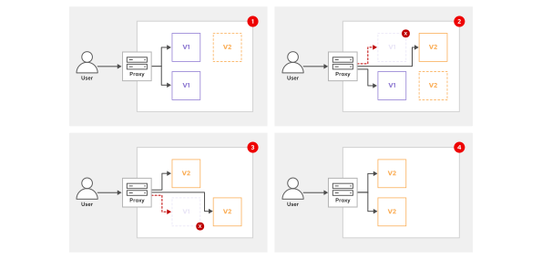
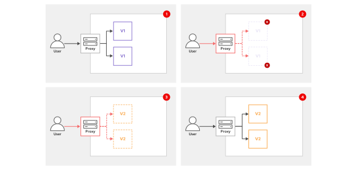

# OPENSHIFT

Part 3/3

## APPLICATION HIGH AVAILABILITY WITH KUBERNETES

### Concepts of Deploying Highly Available Applications

Hight availablility (HA) is the goal to make applicaion robust and resistant to runtime failure. By
implementing HA techiques reduces the possibilty of the applicaion of being unavailable to users.

In general, HA can protect an applicaion from falure in the following context

- From itself in the form of application bugs
- From its environment, such as networking issues
- From other applications that exhaust cluster resources

Also HA practices can protect the cluster from applicaion such as one with a memory leak.

#### Writing Reliable Applications

HA tooling mitigate worst-case scenarios. HA is not a way for replacing application issues. Applications
must work in the cluster so that OpenShift can handle failure scenarios.

OpenShift expects the following from applications:

- Tolerates restarts
- Responds to health probes, such as the startup, readiness, and liveness probes
- Supports multiple simultaneous instances
- Has well-defined and well-behaved resource usage
- Operates with restricted privileges

Applicaion can run without these behaviours, applicaion with these behaviours better use the reliability
and HA feature that Kubernetes provides.

Many web based applicaions provide an endpoints for verification of applications health. The cluster
can monitor the endpoint for possible issues with the applicaion.

It is the application and its developer that is responsible for providing an endpoint so that decision
about the health (os state) of the application can be done. AS an exaple the health of an application
can depend on a databse connection, no connection is a bad state. But not all application have or need
a database so the database connection check is not needed. It is all up to the developers to provide
a way for checking the healt /stae of the applicaion.

### Kubernetes Application Reliability

When a application in a pod crashes it can not respond to requests, depending on the configuration the
cluster can automatically restart the pod. If the applicaion only fails without crashing the pod will
continue to exists bot can still not respond to reqests.

The cluster can detect and act on a running bit unhealth pod only with the appropriate health probes.

Kubernetes has the following HA techiques to improve application reliability

- Restarting pods  
	By configuring a restart policy on a pod, the cluster restarts misbehaving instances of an application.

- Probing  
	By using health probes, the cluster detects when applications cannot respond to requests, and can
	automatically act to mitigate the issue.

- Horizontal scaling  
	When the application load changes, the cluster can scale the number of replicas to match the load.

#### Restarting Pods

A container inside a pod can terminate for different reasons. The pod *restartPoliy' specifies how the
*kubelet' should handle the failure. The values are *Always*, *OnFailure* and *Never*.

| Policy    | Description |
|---        |---          |
| Always	| The kubelet always restarts a terminated container. This policy is the default. |
| OnFailure | The kubelet restarts a terminated container only if it exited with a non-zero exit code. |
| Never     | The kubelet never restarts a terminated container. |

NOTE!  
For application workloads, you typically use higher-level controllers such as Deployment or StatefulSet
to manage pods. These controllers ensure that a specified number of replicas are always running.
If a pod that is managed by a Deployment fails, then the controller automatically creates another pod
to replace it, which is a core HA mechanism. These controllers require the pod template's restartPolicy
field to be set to Always.

---

## Application Health Probes

### Kubernetes Probes

Keeping a cluster health is done with health probes, they enables the cluster to determin the status
of application by repeatedly probing it for a response.

Helth probes affects the cluster ability to do the following tasks:

- Mitigate crashes by automatically attempting to restart failing pods.
- Manage failover and load balancing by sending requests only to healthy pods.
- Monitor pods by determining whether and when they are failing.
- Scale applications by determining when a new replica is ready to receive requests.

### Authoring Probe Endpoints

An application should have health probe endpoints, this should be considered during its development.
These endpoints determin the health and status of the applicaion. An example could be a health prode
that verified an application sucessful connection to the database.

A health probe must be performed quickly since the cluster calls them often. An endpoint should not
perform complicated database queries or network calls.

### Probe Types

Kubernetes has the following types of probes and it is up to the applicaion which probes one or more
that needs to be configurered

- Startup probes  
	A startup probe determin if the applicaions startup process is complete. After this probe is
	successful it will not be called again (unilke liveness). If the startup probe fails after a configured
	timeout the pod will restart based on its restartPolicy.
	
	Add a statup probe to applicaion that has a long start time.
	
	A startup probe starts or hands the probing over to the liveness probe.

- Readiness probes  
	Determin if the applicaion is ready to respond to requests, if the readiness probe fails then Kubernetes
	will remove the pods IP adress from the service resource to prevent request reaching the pod (application).
	
	Readiness probe helpls to detect temporary issues that affect the application during start (not 
	using startup probe), loading files into cache or perforing oter tasks that takes time. The application
	migh need to run a batch kobs that makes it unavailble to requests.
	
	The liveness probes will continue to check, after a fail and the probe is successful the pods IP
	is put back to the service resource and requests are sent to the pod again.
	
- Liveness probes
	Like the readiness probe the liveness probe is called throughout the lifetime of the application.
	It will determin the health state of the pod/container if it fails the liveness probe enough times
	the cluster will restart the pod according to its restart policy.
	
	The liveness probe only runs after the startup probe hands it over.

### Types of Tests

Specify one of the following types of test to perform when defining a probe.

- HTTP GET  
	Each time the probe runs, the cluster sends a HTTP GET request to a specific HTTP endpoint. The
	test is successful if the request gets a HTTP response code beween 200 and 399. Other response
	code is considered as fail.

- Container command  
	Each time the probe runs, the cluster runs a specific command in the container. If the command
	exists with status 0 then the test is successful, other exit code causes the test to fail.
	
- TCP socket  
	Each time the probe runs, the cluster attemps to open a socket to the container on a specified 
	port. The test succeeds only if the connection is made.

### Timings and Thresholds

All the test done by the probes include timeing variables.

- The *periodSeconds* variable determin hos often the probes will run.
- The *failureThreshold* defins how many failed attempts are required before the probe fails.

A probe that has a failure threshold of 3 and a period of 5 sec can fail up to 3 times before the probe
fails, an issue can persist between 10 sec 15 sec before the probe fails.

Running a probe to often wastes cluster resources, a balance beween the values when running probes
are needed.

### Adding Probes by Using a YAML File

Probes are defined in the pods part of the manifest.

	Example of a probe in a deployment
	-----
	apiVersion: apps/v1
	kind: Deployment
	...
	spec:
	...
	  template:
		spec:
		  containers:
		  - name: web-server
		    ...output omitted...
		    livenessProbe: #1
		      failureThreshold: 6 #2
		      periodSeconds: 10 #3
		      httpGet: #4
		        path: /health #5
		        port: 3000 #6
		        
	
	Explain the probe in the deplyment Yaml
	-----
	#1: Defines a liveness probe.
	#2: Specifies how many times the probe must fail before mitigating.
	#3: Defines how often the probe runs.
	#4: Sets the probe as an HTTP request and defines the request port and path.
	#5: Specifies the HTTP path to send the request to.
	#6: Specifies the port to send the HTTP request over.

### Adding Probes via the CLI

Use the 'oc set probe ...' command to add or modify a probe on a resource.

	'oc set probe deployment/front-end \
	--readiness \ #1
	--failure-threshold 6 \ #2
	--period-seconds 10 \ #3
	--get-url http://:8080/healthz' #4

	Explaination to the 'oc set' command
	-----
	#1: Defines a readiness probe.
	#2: Sets how many times the probe must fail before mitigating.
	#3: Sets how often the probe runs.
	#4: Sets the probe as an HTTP request, and defines the request port and path.

NOTE!
The 'oc set probe ...' command is exclusive to RHOCP and oc.

### Adding Probes via the Web Console

Add, modify a probe on a deployment is done in the web console, go to "Workloads -> Deployment" menu
and select a deployment. Click "Actions", click "Add Health Checks", click "Edit probe" to specify the
readuness type, HTTP header, path, port and more.

---

## RESERVING COMPUTE CAPACITY FOR APPLICATIONS

### Kubernetes Pod Scheduling

OpenShift pod schedular places new pods onto nodes in the cluster. Appropriate scheduling prevents resource
contention and places workloades on nodes that meets their specific requirements.

The pod schedulare  algorithm follows a three-step process:

- Filtering nodes  
	A pod can define a node by matching the labels in the cluster nodes, only nodes with matching labels
	are considered.
	
	The schedulare filter the list of running nodes by evaluation each node. A pod can define resouce
	targets for compute resources such as CPU, memory and storage. Only nodes with enought availbe compute
	resources are considered.
	
	The filtering removes nodes that done meet the requirments, it is a possible that the pod run out of
	nodes. If no node meets the requirments it can not be scheduled until the requirements are meet.
	
	If all nodes are filtered out a *FailedScheduling* event is generatedfor the pod.
	
- Prioritizing nodes  
	By using multiple priority criteria, the scheduler determines a weighted score for each node.
	Nodes with higher scores are better candidates to run the pod.

- Selecting a node  
	The schedulare sorts the nodes accoring to these scrores and select a node with the highest score.
	If multiple nodes with the same score is found a node is selected by round-robin. After a node is
	selected the cluster genereates a *scheduled* event for the pod.

NOTE!
The scheduler is flexible and can be customized for advanced scheduling situations.

### Configuring Compute Resource Requests

Application that require specific amount of compute resources, it can be added to the pod definition.
The resource request assign hardware resource for the applicaion deployment.

A resource request specifies the minimal required compute resources. The schedulare tries to find a 
node with enuogh resorces available to satisfy the pod requirment.

In Kubernetes the memory resources are mesuered in bytes and CPI resources are measured in CPU units.
CPU units are allocated by using millicore units. A millicore is a CPU core, either virtual or physical,
that is split into 1000 units. A request value of "1000 m" allocates an entire CPU core to a pod.
You can also use fractional values to allocate CPU resources. For example, you can set the CPU resource
request to the 0.1 value, which represents 100 millicores (100 m). Likewise, a CPU resource request
with the 1.0 value represents an entire CPU or 1000 millicores (1000 m).

You can define resources for each container in the a deployemnt resource. If not define resources then
the container specification shows a *"recources: {}"* section.

To specify resources modify the *"recources: {}"* section int the deployment. 

	...
    spec:
      containers:
      - image: quay.io/redhattraining/hello-world-nginx:v1.0
        name: hello-world-nginx
        resources:
          requests:
            cpu: "100m"
            memory: "1Gi"
	...
	
	Shows a request of 100 millicores (1000m) of CPU and 1 gibibyte (1Gi) of memory

You can use 'oc edit ...' command to modify a deployment or use 'oc set resources ...' command.

	'oc set resources deployment hello-world-nginx --requests cpu=100m,memory=1gi'
	Define a resource request on a running deployment.

The oc set resources command works with any resource that includes a pod template, such as Deployment
and Job resources.

### Inspecting Cluster Compute Resources

Availbe compute resources on a node can be viewed by a cluster administrator using the 'oc describe node ...'
command. The output will shows the availbe resources on the node and how much is used.

	'oc describe node master01' ->
		Name:               master01
		Roles:              control-plane,master,worker
		...
		Capacity:
		  cpu:                  8
		  ephemeral-storage:    125293548Ki
		  hugepages-1Gi:        0
		  hugepages-2Mi:        0
		  memory:               20531668Ki
		  pods:                 250
		Allocatable:
		  cpu:                  7500m
		  ephemeral-storage:    114396791822
		  hugepages-1Gi:        0
		  hugepages-2Mi:        0
		  memory:               19389692Ki
		  pods:                 250
		...
		Non-terminated Pods:                                (88 in total)
		  ... Name           CPU Requests  CPU Limits  Memory Requests  Memory Limits ...
		  ... ----           ------------  ----------  ---------------  -------------
		  ... controller-... 10m (0%)      0 (0%)      20Mi (0%)        0 (0%)        ...
		  ... metallb-...    50m (0%)      0 (0%)      20Mi (0%)        0 (0%)        ...
		  ... metallb-...    0 (0%)        0 (0%)      0 (0%)           0 (0%)        ...
		Allocated resources:
		  (Total limits may be over 100 percent, i.e., overcommitted.)
		  Resource           Requests       Limits
		  --------           --------       ------
		  cpu                3183m (42%)    1202m (16%)
		  memory             12717Mi (67%)  1350Mi (7%)
		...
	
	Displays the amount of allocated and requested resources on the node, 42% of CPU used and 67% of
	the memory.

OpenShift cluster adminitrators can use the 'oc adm top pods ...' command to show th resources for
each pod in a project. The namespace for a project must be include or the current project is used.

	'oc adm top pods -n openshift-dns' ->
		NAME                  CPU(cores)   MEMORY(bytes)
		dns-default-5kpn5     1m           33Mi
		node-resolver-6kdxp   0m           2Mi
	
	Resource usage for pods in the project "openshift-dns"

Also 'oc adm top nodes' command can be used by cluster administrators to see the resource usage
of the cluster nodes. Including the node name you can view a specific node.

	'oc adm top node master01' ->
		NAME       CPU(cores)   CPU%   MEMORY(bytes)   MEMORY%
		master01   1250m        16%    10268Mi         54%

## LIMIT COMPUTE CAPACITY FOR APPLIACTIONS

Memeory and CPU requests that are defined for containers helps OpenShift to select which compute node
to run the pod. But these resource request does not restrict the memory and CPU that the containers
can use.

It is recommeded that you set the memory and CPU request to the peak usage of the applicaion. If only
setting lower values you can overcommit a node when all application start using resources above the
values they requested and then the node can run out of memory and CPU.

That is why in additions to requests you are able to set memory and CPU limits to prevent the application
to consume to much resources.  

### Setting Memory limits

A memory limit specifies the amount of memeory that a container can use acress all its processes.

When the container reaches the limit the computer node selects and then kills a process in the container.
When that event occurs OpenShift detects that the applicaion is not working correctly since the main
container process is missing or because the health probe reports an error. OpenShift then restarts the
pod according to the *restartPolicy* that is by default always.

OpenShift relies on Linux kernel features to implemet the resource limits and to kill processes in containers
that reached therir memory limit.

- Control groups (cgroups)  
	OpenShift uses control groups to add resource limits. Control groups are a Linux kernel mechanism
	for controlling and monitoring system resources, such as CPU and memory.

- Out-of-Memory killer (OOM killer)  
	When a container reaches its memory limit, the Linux kernel triggers the OOM killer subsystem to
	select and then kill a process.

When setting the memory limit for an application you must consider the memory usage pattern. If a memory
leak exist this will affect the appliction and this bug needs to be fixed. The idea with setting a memory
limit is to prevent a memory leak or what ever to consume all of the nodes memory. Sett a memory limit
enabels OpenShift to regulary restart applicaion to free up their memy when the limit is reached.

	'oc set resources deployment/hello --limits memory=1Gi
	Using 'oc set resources ...' to set the memory limit
	
	Example of Yaml for setting the memory request and limit
	-----
	apiVersion: apps/v1
	kind: Deployment
	...
	  spec:
		containers:
		- image: registry.access.redhat.com/ubi9/nginx-120:1-86
		  name: hello
		  resources:
		    requests:
		      cpu: 100m 
		      memory: 500Mi #1
		    limits:
		      cpu: 200m
		      memory: 1Gi #2
	
	Explain the limit and request of the memory
	-----
	#1: The memory request
	#2: The memory limit

When OpenShift restarts a pod beacuse of a OOM event it updates the pods *lastState* attribute and sets
the reason to *OOMKilled*

	'oc get pod hello-67645f4865-vvr42 -o yaml' ->
		...
		status:
		...
		  containerStatuses:
		  - containerID: cri-o://806b...9fe7
			image: registry.access.redhat.com/ubi9/nginx-120:1-86
			imageID: registry.access.redhat.com/ubi9/nginx-120:1-86@sha256:1403...fd34
			lastState:
			  terminated:
				containerID: cri-o://bbc4...9eb2
				exitCode: 137
				finishedAt: "2023-03-08T07:56:06Z"
				reason: OOMKilled
				startedAt: "2023-03-08T07:51:43Z"
			name: hello
			ready: true
			restartCount: 1

To set the memory limit for a container in a pod from the web console select a deployment and click
"Actions -> Edit resource limits". Set memory limits by increasing or decreasing the memory on the
"Limit" section.

### Setting CPU Limits

CPU limit works different dfrom memory limits. When a container reached the CPU limit Openshift do not
allow anything more even if CPU cycles are avaible on the node. The application continues to work but
at a slower pace then it could with more CPU.

But if you do not set a CPU limit the applicaion can consume as much CPU that is avaible on the node.
If the nodes CPU are under presure, from CPU intensive containers then the Linux kernel will share the
CPU resources between these containers according to the CPU request value for the containers.

You need to set the CPU limit to make sure that you hav a consistent applicaion behavior across the
cluster and its nodes. Example if the container has no CPU limit on a node that CPU is available it 
can take advantage of the speed. While on a node where the CPU is limited the same task will take longer.
This is why a CPU limit should be set to make the taks consistent when it comes to CPU usgae.

This issue may also occur between test and production enviroment since no enviroment is thesame by setting 
a CPU limit the applicaion will perform thesame in bothe enviroment.

NOTE!
Clusters can have differences in hardware configuration beyond what limits observe. For example,
two clusters' nodes might have CPUs with equal core count and unequal clock speeds.
Requests and limits do not account for these hardware differences. If your clusters differ in such a
way, take care that requests and limits are appropriate for both configurations.

By setting a CPU limit you mitigare the difference between configuration on the nodes and you experience
a more consistent behavior.

	'oc set resources deployment/hello --limits cpu=200m'
	Setting the CPU limit using 'oc set resources ...' command
	
	Example of Yaml for setting the memory request and limit
	-----
	apiVersion: apps/v1
	kind: Deployment
	...
	  spec:
		containers:
		- image: registry.access.redhat.com/ubi9/nginx-120:1-86
		  name: hello
		  resources:
		    requests:
		      cpu: 100m #3
		      memory: 500Mi 
		    limits:
		      cpu: 200m #4
		      memory: 1Gi 
	
	Explain the limit and request of the memory
	-----
	#3: The CPU request
	#4: The CPU limit

To set CPU limit for a container in a pod using the web console select the deployment and click 
"Actions -> Edit resource limits". Set CPU limits by increasing or decreasing the CPU on the "Limit"
section.

### Viewing Requests, Limits, and Actual Usage

Using OpenShift CLI cluster administrators can view compute usage on individual nodes. 
'oc describe node ...' command displays detailed information abouit a node, including the information
about which pods that are running on the node. For each pod it will show both the CPU and memory requests
and limits. If a request or limit was not specified  then the pod wil show a 0 for that column. The 
command will also show a summary of all the resorce requests and limits.

	'oc describe node master01' ->
		Name:               master01
		Roles:              control-plane,master,worker
		...
		Non-terminated Pods:                                (88 in total)
		  ... Name           CPU Requests  CPU Limits  Memory Requests  Memory Limits ...
		  ... ----           ------------  ----------  ---------------  -------------
		  ... controller-... 10m (0%)      0 (0%)      20Mi (0%)        0 (0%)        ...
		  ... metallb-...    50m (0%)      0 (0%)      20Mi (0%)        0 (0%)        ...
		  ... metallb-...    0 (0%)        0 (0%)      0 (0%)           0 (0%)        ...
		...output omitted...
		Allocated resources:
		  (Total limits may be over 100 percent, i.e., overcommitted.)
		  Resource           Requests       Limits
		  --------           --------       ------
		  cpu                3183m (42%)    1202m (16%)
		  memory             12717Mi (67%)  1350Mi (7%)
		...

The 'oc describe node ..' displays the request and limits, The 'oc adm top nodes' will show resource
usage for nodes in the cluster.

The 'oc adm top pods ...' command will show the resource usage for each pod in a project

	'oc adm top pods -n openshift-console' ->
		NAME                         CPU(cores)   MEMORY(bytes)
		console-6689c8589c-bcpb7     1m           48Mi
		downloads-79658645bd-hx649   1m           31Mi
	
	Resource usage in the project "openshift-console"

To visualize the consumption of resources from the web console, select a deployment, and click the 
"Metrics" tab. From this tab, you can view the usage for memory, CPU, the file system, and incoming
and outgoing traffic.

---

## APPLICATION AUTOSCALING

Kubernetes can autoscale a deployment based on the current load on the application pods, using the
*HorizontalPodAutoscaler* resource type.

### Horizontal Pod Autoscaling

In production the applicaion load can very much and manually scalling the applicaion to fit is inefficient
and prone to error. OpenShift provides an automataed solution for this by using the Horizontal Pod Autoscaler
(HPA) it automatically scales the pods in a replicaion controller, deployment, replica set or stateful
set based on observed metrics such as CPU utilization.

Effective autoscaling is critical for several reasons

- High Availability and Performance  
	By automatically adding pods during traffic spikes, the HPA ensures that the application remains
	responsive and meets its service-level objectives.

- Cost Optimization  
	During periods of low traffic, the HPA scales down the number of pods. Removing the extra pods releases
	unused resources back to the cluster, to enable other workloads to use them and to optimize overall
	resource usage.

- Operational Efficiency  
	Automating the scaling process removes the need for manual intervention by operations teams. The
	automation reduces the risk of human error and enables engineers to focus on other tasks.

### The Autoscaling Process in Kubernetes

The HPA is a control loop that runs inside Kubernetes control manager. The *HorizontalPodAutoscaler*
resource uses metrics that the monitoring stack collects, it is preinstalled in OpenShift. The control
manager check the HPA resource every 15 seconds, during each check (loop) it does the following

- The autoscaler retrieves the target metric for scaling from the HPA resource definition.
- For each pod that the HPA resource targets, the autoscaler collects the current value of the metric
	from the metrics server.
- For each targeted pod, the autoscaler computes the usage percentage, based on the collected metric
	and the resource requests that are defined in the pod specification.
- The autoscaler computes the average usage across all the targeted pods.
- It establishes a ratio between the target metric value and the current average metric value.
- The autoscaler uses this ratio to make a scaling decision, either to increase or to decrease the number
	of replicas for the target resource.

### Prerequisites for Autoscaling

Autoscaling a deployment requires that the resource request is specified for containers in the pods.
These resource requests values are used to calculate the usage by the HPA. The autoscaler requires resource
requests to calculate utilization and to perform scaling actions.

IMPORTANT!  
Pods that are created by using the oc create deployment command do not define resource requests by
default. Using the RHOCP autoscaler might therefore require editing the deployment resources to add
requests. Alternatively, you can create custom YAML resource files for your application. You can also
add to your project a LimitRange resource, which defines default resource requests for pods.

### Creating a Horizontal Pod Autoscaler

You can create an HPA resource by using the command line, a YAML manifest, or the web console.

#### Using the 'oc autoscale' Command

To create a *HorizontalPodAutoscaler* resource from the command line, use the oc autoscale command:

	'oc autoscale deployment/hello --min 1 --max 10 --cpu-percent 80'
	Creates a HPA for the "hello" deployment. A pod count between 1-10 replicas. It will scale the
	deployment to keep the average CPU usage of the pods at or below 80%.

The max and min values for a horizontal pod autoscaler resource takes into considiration burst to avoid
overloading the OpenShift cluster. If the load of the applicaion changes to quickly it helps keeping some
spare pods online to help with the requests. But at the same time to many pods can use up all of the
clusters capcity and interfear with other applicaion in the cluster.

#### Using a YAML Manifest

For advanced configurations you can define a HPA resource in a manifest file.

An example of creating an HPA resource that scales based on CPU usage. 

	Example of a HPA resource Yaml file, scale by CPU unage
	-----
	apiVersion: autoscaling/v2
	kind: HorizontalPodAutoscaler
	metadata:
	  name: hello
	spec:
	  minReplicas: 1   #1
	  maxReplicas: 10  #2
	  metrics: #3
	  - resource:
		  name: cpu
		  target:
		    averageUtilization: 80  #4
		    type: Utilization
		type: Resource
	  scaleTargetRef:  #5
		apiVersion: apps/v1
		kind: Deployment
		name: hello
	
	Explain the HPA manifest
	-----
	#1: The minReplicas field specifies the minimum number of pods.
	#2: The maxReplicas field specifies the maximum number of pods.
	#3: The metrics array defines the metrics to use for scaling decisions.
	#4: The averageUtilization field specifies the target average CPU utilization for each pod,
		and is represented as a percentage. If the global average CPU usage is above that value,
		then the horizontal pod autoscaler starts new pods. If the global average CPU usage is
		below that value, then the horizontal pod autoscaler deletes pods.
	#5: The scaleTargetRef field points to the resource that the HPA manages.
	
	'oc apply -f hello-hpa.yaml'
	Use the oc apply command to create the resource from the file.

Alternatively, it can scale based on memory usage by setting the resource name to memory.

	Example of a HPA resource Yaml file, scale by memory unage
	-----
	apiVersion: autoscaling/v2
	kind: HorizontalPodAutoscaler
	metadata:
	  name: hello
	spec:
	  minReplicas: 1
	  maxReplicas: 10
	  metrics:
	  - resource:
		  name: memory #1
		  target:
		    averageUtilization: 80
	...
	
	Explain the HPA manifest
	-----
	#1: The resource name is set to memory to trigger scaling based on memory utilization.

NOTE!
Memory-based autoscaling is not suitable for all applications. For example, applications that are
based on the Java Virtual Machine (JVM) often claim large memory at startup and do not release it.
If an application's memory usage does not correlate with its load, then memory-based autoscaling
might not be effective.

#### Using the Web Console

As the deleveroper in the web console select a project and click "Topology" menu, click the deployment
for the applicaion to display the details. Select "Action -> Add HorizontalPodAutoscaler", use the Add
Horizontal Pod Autoscaler form or YAML view to set the HPA parameters.

### Verifying Horizontal Pod Autoscaler Status

You can moitor the staus of the HPA object after it has been created.

#### Viewing HPA Objects

Use *'oc get hpa'* to get information about the HPA resource in the current project

	'oc get hpa' ->
		NAME    REFERENCE          TARGETS         MINPODS   MAXPODS   REPLICAS   AGE
		hello   Deployment/hello   <unknown>/80%   1         10        1          30s

At start the HPA has the value _unknown_ in the *TARGETS* column, it might tak up to five minutes to
display the current usage. If the value _unknown_ persist it might indicate that the target deployment
does not define resource request for the specified target. The HPA only scales with resource requests.

#### Inspecting HPA Details and Events

Use *'oc describe hpa ..."* for detailed informaion. It will show the HPA configuration, metrics and
a log of recent scaling events.

	'oc describe hpa hello' ->
		...
		Events:
		  Type    Reason             Age    From                       Message
		  ----    ------             ----   ----                       -------
		  Normal  SuccessfulRescale  16m    horizontal-pod-autoscaler  New size: 2; ...
		  Normal  SuccessfulRescale  14m    horizontal-pod-autoscaler  New size: 4; ...
		  Normal  SuccessfulRescale  14m    horizontal-pod-autoscaler  New size: 8; ...
		  ...

The event section is usefule for troubleshooting since it provides a record of when and why the HPA
scaled up or down th target resource.

---

## CONTAINER IMAGE IDENTITY AND TAGS

### Kubernetes Image Tags

A container image name cinsist of several parts. The image "registry.redhat.io/rhel9/nginx-124:9.6"
consists of four parts

- The registry: "registry.redhat.io"
- Namespace: "rhel9"
- Name of the image: "nginx-124", in this case if also reference a version ot the nginx used, "1.24"
- The tag that tells the specific version ogf this image, "9.6". If you leave out the tag the default
	tag "latest" is used.

Mutiple tags can point or refer to the same image. 

Red Hat Ecosystem Catalog at https://catalog.redhat.com/software/containers/explore

When multiple tag exists on an image some of the tags are *floating tags*. A *floating tag* is something
that changes over time, the tag "latest" is one of those tas, when a new image version is created it
will get the tag "latest". Another *floating tag* that sometimes are used is "1".

If you specify a floating tag you ensure that you always use an up-to-date image version.

#### Floating Tag Issues

Anyone that publishes images establish their own lifecycle for *floating tags*. The reassign *floating
tags* without notice.

Using images you may not notice that a tag have been reassign to an new image version.

As an example suppose you deploy an image with the "latest" tag, this is what could happen.

1. When OpenShift deploys the container it pulls the image with the latest tag from the container registry.
1. Later the the image developer creates a updated image and assigns the "latest" tag to it.
1. Openshift realocates the pod to a different node as it fails or the replica scales up the number
	of pods
1. On the new node OpenShift pulls the image with the "latest" tag, that actually is a updated version
	of the applicaion.
1. Now the deployment might run a newer version that you are not aware of or even worse different versions
	since the replica scaled up.

Is is not good that you run a newer version of the applicaion (container image) that you are not aware of. 
But it is a disater if you run to different version of the applicaion in the cluster. 

To prevent this issue from happening select an image that will not change over time.

Select an static image can be done in several ways.

- Use a tag that does not change, instead of relying on floating tags.
- Use OpenShift image streams for tight control over the image versions.
- Use the Secure Hash Algorithm (SHA) image ID instead of a tag when referencing an image version.

Distinction between floating and non-floating tags is not technical but convension. A developer should
not, but can, push an image to an existing tag. To guarantee that the refrenced image does not change
you must specify the SHA image ID. 

#### Using an SHA Image ID

SHA image ID also knwon as Digest

Developers assigns tags to images while a SHA image ID, or disest, is a unique identifier that the container
registry computes and assigns to images. The SHA image ID is immutable string that refers to a specific
image version. THis is the most secure approch of identifying an image.

To refer to an image by id SHA ID replace *name:tag* with *name@SHA-ID*.
Example: "registry.redhat.io/rhel9/nginx-124@sha256:126903359331eb9f2c87950f952442..."

use the 'oc image info ...' command to get the SHA image ID.

	NOTE!
	A multi-architecture image references images for several CPU architectures. Multi-architecture
	images include an index that points to the images for different platforms and CPU architectures.
	
	For these images, the oc image info command requires you to select an architecture by using
	the "--filter-by-os option":
	
	'oc image info registry.redhat.io/rhel9/nginx-124:9.6' ->
		error: the image is a manifest list and contains multiple images - use --filter-by-os to select from:
		
		  OS               DIGEST
		  linux/amd64      sha256:c83789b0c7765e172bee5d36948e63e5db43248d8a3d69a3bb1...
		  linux/arm64/v8   sha256:dd239a25567a7b3887848b927bf9376fc76c4c4a57290afee55...
		  linux/ppc64le    sha256:0e9df5ef304708e1244697dc127816f07ece420bc47ea388cf1...
		  linux/s390x      sha256:0dd7ddd965e11c8a70fbcc66499b72de4e508afb0e4dfca48e8...

Two ways of displaying the SHA ID

- 'oc image info ...' way

		Example of displaying the SHA ID for the image thath the "9.6" tag points to
		-----
		'oc image info --filter-by-os linux/amd64 registry.redhat.io/rhel9/nginx-124:9.6' ->
			Name:      registry.redhat.io/rhel9/nginx-124:9.6
			Digest:    sha256:c83789b0c7765e172bee5d36948e63e5db43248d8a3d69a3bb1... #1
			Manifest List: sha256:126903359331eb9f2c87950f952442db456750190956b9301d0...
			Media Type:    application/vnd.oci.image.manifest.v1+json
			...
		
		Explaination for the display
		-----
		#1: The SHA image ID, or digest, for the specified image tag and architecture.

- You can also use the 'skopeo inspect ...' command, the output will differ but contain the same info

		'skopeo inspect docker://docker.io/nginx:stable-alpine3.23-perl' ->
			{
				"Name": "docker.io/library/nginx",
				"Digest": "sha256:16c58a4b4a299bd3a078c73f31d4b692c7b07010fc56e38f4dff06d5ae4d41c6",
				"RepoTags": [
					"1",
					"1-alpine",
					...
				]
				...
			}

When you use the 'oc debug node/node-name' to connect to a node you can list the locally availbe images
by running 'crictl images --digests --no-trunc' command. The "--digest" flag will provide you with
the Digest in the response and "--no-trunc" flag will make sure that the whole SHA ID is displayed
and not a few characters.

	'oc debug node/node-name' ->
		Temporary namespace openshift-debug-csn2p is created for debugging node...
		Starting pod/node-name-debug ...
		To use host binaries, run `chroot /host`
		Pod IP: 192.168.50.10
		If you don't see a command prompt, try pressing enter.

		sh-4.4# chroot /host
		sh-4.4# crictl images --digests --no-trunc registry.redhat.io/rhel9/nginx-124:9.6
			IMAGE                                TAG   DIGEST               IMAGE ID    ...
			registry.redhat.io/rhel9/nginx-124:  9.6   sha256:c837...71de   2e68...949e ...

	The IMAGE ID column displays the local image identifier that the container engine assigns to
	the image. This identifier is not related to the SHA ID.

The container image format felies on SHA-256 hashes to identify severla images components, image layers,
image metadata, ... Command might contain SHA-256 strings you need to ensure that the SJA-356 hash
corresponds to the SHA imgae ID.

### Selecting a Pull Policy

Deploying an image, OpenShift selects a node to run the pod. On the node OpenShift first needs to pull
the image then start the container.

Setting *imagePullPolicy* attribute in the deployment resourceyou are able to control how OpenShift
pulls the image.

	Example shows the deployment resource
	-----
	'oc get deployment myapp -o yaml' -> 
		apiVersion: apps/v1
		kind: Deployment
		...
		  template:
			metadata:
			  creationTimestamp: null
			  labels:
				app: myapp
			spec:
			  containers:
			  - image: registry.redhat.io/rhel9/nginx-124:9.6
				imagePullPolicy: IfNotPresent #1
				name: nginx-124
		...
	
	Explain the imagePullPolicy
	-----
	#1: The image pull policy is set to IfNotPresent.

The *imagePullPolicy* attribute can have the following values

- IfNotPresent  
	If the image is present locally on the compute node it will be used else Openshift will pull it
	from the registry.
	
	If a floating tag was used as an container image and that image tag is present locally on the
	compute node it will be used. Even if the floating tag might have been pointed to a newer image.
	If the floating tag is not present locally it will be pulled to the compute node.
	
	By default OpenShift sets the *imagePullPolicy* to *IfNotPresent* when you use a tag or SHA ID
	to identify the image.

- Always  
	OpenShift verifies if an updated version of the image is availble in the registry. It compairs
	the remote SHA ID in the remote registry to the SHA ID of the local SHA ID of the image if the
	image is present. If the two ids are the same it uses the local image otherwise it pulls the image.
	
	If using a floating tag OpenShift compairs the remote registry image SHA ID to the local image
	SHA ID, if a new version of the image exists and the floating tag have been updated OpenShift
	will pull the remote image.

	OpenShift sets the *imagePullPolicy* to *Always* by default if you use the "latest" tag or when
	you do not specify a tag.

- Never  
	Open Shift does not pull the image, it expects that the image to be present locally on the node.
	Otherwise the deployment will fail.
	
	When using the pulll policy you must premair the compute nodes with the images that you want to
	use. This policy is used to improve speed and vaid relaying on the registry for those images.

### Pruning Images from Cluster Nodes

An container image is not removed automatically since OpenShift can reuse an container image instead
of pulling them every time a pod is deployed.

Because of this container images comsume disk on the compute nodes. OpenShift needs to remove or 
prune unused images to reclaim diskspace. The *kubelet* process that runs the compute nodes includes
a garbage collection that runs every 5 min. When the space on the file system that stores the images
is above 85% then the garbage collector removed the oldest unused images. The garbage collection
stops when the file system usage drops below 80%.

The thresholds can be adjusted.

From a compute node you can run *'crictl imagefsinfo'* to retrive the name of the file system thatstores the images. 

	'oc debug node/master01' ->
		Temporary namespace openshift-debug-csn2p is created for debugging node...
		Starting pod/node-name-debug ...
		To use host binaries, run `chroot /host`
		Pod IP: 192.168.50.10
		If you don't see a command prompt, try pressing enter.

		sh-4.4# chroot /host
		sh-4.4# crictl imagefsinfo
			{
			  "status": {
				"timestamp": "1674465624446958511",
				"fsId": {
				  "mountpoint": "/var/lib/containers/storage/overlay-images"
				},
				"usedBytes": {
				  "value": "1318560"
				},
				"inodesUsed": {
				  "value": "446"
				}
			  }
			}
	
	NOTE!
	The oc debug node and crictl commands require cluster administrator privileges.

	Explaination to the above output
	-----
	The file system that stores the images is "/var/lib/containers/storage/overlay-images", it consumes
	1318560 bytes of disk.

On a compute node you can use 'crictl rmi' command to remove an unused image. But using the 'crictl'
command might interfear with the garbage collecor and the kubectl process.

It is recommended to rely on the garbage collector to prune unused objects, images and container on
the compute nodes. The garbage collector is configured to better fulfill any custom needs. The garbage
collector thresholds are configurable via the KubeletConfig Custom Resource (CR).

---

## UPDATE APPLICATION IMAGE AND SETTINGS

### Application Code, Configuration, and Data

A modern applicaion consists of code, configuration and data. Both the configuration and data are not
hardcoded as part of the software. The software loads both the configuration and data from external
sources. This allows the same software to be used in different environments without the the need to
change the code in the software.

OpenShift provides configuration map, secrets and volumes resources to store the applications configuration
and data. The code of the application is available in the container image.

Openshift deploys the container image as the application and a new version of the image must be built
when the code gets updated for the applicaion. Some use a CI/CD pipeline to automatically build an image
form the applicaion source code. The build image gets pushed to a registry.

You use OpenShift resources, configuraion maps and secrets to update the applicaions configuration.
To control the deployment process of a new Image version, use a *Deployment* object.

### Deployment Strategies

With CI/CD pipeline deploying application changes or new versions are a big part.

An application change can carry a risk, downtime during deployment, bugs or reduced performence.
Risks can be reduce or mitigate some risk with testing and validation stages in pipelines.

Downtime can result in lost business, sla breatches or distrupt other service that depend on your
appliaction.

In OpenShift you can use a Deployment objects is used to define aDeployment and deployment strategies.
The main OpenShift strategies are *RollingUpdate* and *Recreate*.

In the Deployment object the Update stategies are set in ".spec.strategy.type"

	Example of a Recreate Deployment strategy
	-----
	apiVersion: apps/v1
	kind: Deployment
	metadata:
	...
	spec:
	  progressDeadlineSeconds: 600
	  replicas: 10
	  revisionHistoryLimit: 10
	  selector:
		matchLabels:
		  app: myapp2
	  strategy:
		type: Recreate
	  template:
	...

#### Rolling Update Strategy

The *RollingUpdate* replaces one instance after anothor until all instances have been replaced. This
means that both version of the applicaion runs at the same time, when the new version of the applicaion
is ready the old version of the applicaion is scaled down. The problem with this strategy is that the
version of the applicaion needs to be compatible in the deployment.

Graphic showing an application using rolling update.

1. Some application instances run a code version that needs updating (v1). OpenShift scales up a new
	instance with the updated application version (v2). Because the new instance with version v2 is
	not ready, only the version v1 instances fulfill customer requests.

1. The instance with v2 is ready and accepts customer requests. OpenShift scales down an instance
	with version v1, and scales up a new instance with version v2. Both versions of the application
	fulfill customer requests.

1. The new instance with v2 is ready and accepts customer requests. OpenShift scales down the remaining
	instance with version v1.

1. No instances remain to replace. The application update was successful and without downtime.

The RollingUpdate strategy support continuous development and eliminates downtime for the applicaion
during development. This strategy work only if different version of the applicaion can run at the
same time.

The RollingUpdate strategy is the default update strategy if not strategy has been defined.

	Example of a deployment manifest using RollingUpdate strategy
	----- 
	apiVersion: apps/v1
	kind: Deployment
	metadata:
	...
	spec:
	  progressDeadlineSeconds: 600
	  replicas: 10
	  revisionHistoryLimit: 10
	  selector:
		matchLabels:
		  app: myapp2
	  strategy:
		rollingUpdate:
		  maxSurge: 25%
		  maxUnavailable: 1
		type: RollingUpdate
	  template:
	...

With the rolling update configuratio nare  two parameters that you need to know, *maxSurge* and *maxUnavailable*.

During an rolling update the numebr of pods vary because OpenShift starts new version pods before the
older version is removed. The *maxSurge* parameter tells how many pods OpenShift can create above the
normal amount of replicas. The *maxUnavailable* parameter tells how many pods can be removed below the
normal amount of replicas. These number can either be set in % (25%) or number (1).

If a readiness probe is configured for the deployment then during a rolling update OpenShift will start
sending traffic to the new pods as soon as they are running. This can cause issues since the container
inside the updated pod might now be ready for request and therefor can not respond and the request will
fail.

By adding a readiness probe to the deployment prevents OpenShift from sending traffic to new pods
that are not ready.

#### Recreate Strategy

Using this strategy all instances of the applicaion is first stopped then replaced with new ones. The drawback of
this strategy is that it will cause downtime during a period not request will be fulfilled.

Graphic showing an application using recreate.

1. The application has some instances that run a code version to update (v1).

1. OpenShift scales down the running instances to zero. Scaling down to zero causes application downtime, because
	no instances are available to fulfill requests.

1. OpenShift scales up new instances with a new version of the application (v2). When the new instances are booting,
	the downtime continues.

1. Starting the new instances resolves the application outage and completes the Recreate strategy.

This strategy is not recommended for applications that need high availability. You can use this strategy when the
application cannot have different version running at the same time. Also use this strategy to execute data migrations
or data transformations before the new version (applicaion / code) starts.

### Rolling out Applications

When the deployment is updated OpenShift automatically rools put the application. If multiple modifications are done
in a row, image update, environment variables, readiness probe then OpenShift will roll out the application for each
modification.

To prevent a multiple deployment update, pause the rollout, apply the modifications to the deployment object and
then resume the rollout. OpenShift will then perform a single rollout to apply all the modifications.

	'oc rollout pause deployment/myapp'
	Pause the rollout for the deplyment "myapp"
	
	'oc set image deployment/myapp nginx-120=registry.access.redhat.com/ubi9/nginx-120:1-86'
	'oc set env deployment/myapp NGINX_LOG_TO_VOLUME=1'
	'oc set probe deployment/myapp --readiness --get-url http://:8080'
	Apply the modifications
	
	'oc rollout resume deployment/myapp'
	Resume the rollout.
	
	OpenShift will rollout the application and apply all modification to the deployment object.

A simulare process can be done when you create and configure a new deployment

	'oc create deployment myapp2 --image registry.access.redhat.com/ubi9/nginx-120:1-86 --replicas 0'
	Create the deployment but set the number of replicas to 0
	
	'oc get deployment/myapp2' ->
		NAME     READY   UP-TO-DATE   AVAILABLE   AGE
		myapp2   0/0     0            0           9s
		
	Confirm that no running pods

	'oc set probe deployment/myapp2 --readiness --get-url http://:8080'
	Apply a modification in this case a readiness probe
	
	'oc scale deployment/myapp2 --replicas 10'
	Scale up the deployment och OpenShift will rollout the applicaion and its pods.
	
	'oc get deployment/myapp2' ->
		NAME     READY   UP-TO-DATE   AVAILABLE   AGE
		myapp2   10/10   10           10          18s
	
	Confirm that the pods are now running
	
	
#### Monitoring Replica Sets

When OpenShift rolls out an application from the Deployment object it creates a ReplicaSet object.
A Replicaset are sresponsible for creating and monitoring the pods. If a pod fails then the replicaset
object deploys a new one.

Replica set used the pod definition in the deployment object to deploy pods. OpenShift copies the
template definition from the deployment object when it creates the replicaset object.

When the deployment object is updated it does not update the replicaset object nut instead creates a
new replicaset object with the new pod template definition. After that OpenShift rolls out the pods
with the applicaition accorinf to the choosen strategy.

Multiple replicaset can exists at the same time for a deployment. During a rollout the earlier and
the new replicaset object coexists and manages the rollpout of the new version. After the rollout
the ealier replicaset object is keep in case you need to do a roll back of the new version.

Graphic showing the deployment object and two replicaset objects. The ealier replicaset object for
version 1 that runs no any pods. And the current replicaset that has version 2 of the applicaion
and has 3 pods.

Never change or delete the replicaset object since is is managed through the deployment object. The
".spec.revisionHistoryLimit" attribute in the deplyment objects specifies how many replicaset object
OpenShift keeps. When the deployment object is deleted OpenShift deleters all associated replicaset
objects.

	'oc get replicaset' ->
		NAME                DESIRED   CURRENT   READY   AGE
		myapp2-574968dd59   0         0         0       3m27s
		myapp2-76679885b9   10        10        10      22s
		myapp2-786cbf9bc8   0         0         0       114s

	Get the current list of replicaset objects. The deployment name is used as a prefix for the
	replica set.
	
	The above shows 3 replicasets objects for the deployment "myapp2". When the "myapp2" deployment is
	modified OpenShift creates a replicaset object. In the list above the second row is the active and
	monitors 10 pods. The other replicaset do not manage any pods.
	
	Example of replicaset during a rollout
	-----
	'oc get replicaset' ->
		NAME                DESIRED   CURRENT   READY   AGE
		myapp2-574968dd59   0         0         0       13m
		myapp2-5fb5766df5   4         4         2       21s  #1
		myapp2-76679885b9   8         8         8       10m  #2
		myapp2-786cbf9bc8   0         0         0       11m

	Explaination of the replicaset during a rollout
	-----
	#1: The new ReplicaSet object already started four pods, but the READY column shows that the
		readiness probe succeeded for only two pods so far. These two pods are likely to receive
		client traffic.
	#2: The ReplicaSet object already scaled down from 10 to 8 pods.

#### Managing Rollout

OpenShift preserves the older replicaset objects from ealier deployments. These are used when the need
of doing a roll back if the new application does not work.

Using the 'oc rollout undo command ...' to rollback to a previous deployment version.

	'oc rollout undo deployment/myapp2'
	Doing a rollback to a previous version (older replicaset)
	
	'oc rollout status deployment/myapp2' -> "deployment 'myapp2' successfully rolled out"
	Seeing the status of the rollout.
	
If a rollout operation fail for some reason, wrong contgainer image, readiness probe fails, ... OpenShift
does not automatically roll back the deployment, ig must be commanded to to so, 'oc rollout undo ...'

By default the 'oc rollback undo ...' command rolls back to the previous version. To roll back even
further you can specify an avaible version.

	'oc rollout history deployment/myapp2' ->
		deployment.apps/myapp2
		REVISION  CHANGE-CAUSE
		1         <none>
		3         <none>
		4         <none>
		5         <none>

	See the rollout history and it list of previous version
	
	NOTE!
	The CHANGE-CAUSE column provides a user-defined message that describes the revision. You can
	store the message in the kubernetes.io/change-cause deployment annotation after every rollout.

	'oc annotate deployment/myapp2 kubernetes.io/change-cause="Image updated to 1-86"'
	Add a annotation ´to the "change-cause"
	
	'oc rollout history deployment/myapp2' ->
		deployment.apps/myapp2
		REVISION  CHANGE-CAUSE
		1         <none>
		3         <none>
		4         <none>
		5         Image updated to 1-86

	After adding the annotation you are able to see it in the rollout history
	
	'oc rollout history deployment/myapp2 --revision 1' ->
		deployment.apps/myapp2 with revision #1
		Pod Template:
		  Labels: app=myapp2
				  pod-template-hash=574968dd59
		  Containers:
		   nginx-120:
			Image:       registry.access.redhat.com/ubi9/nginx-120:1-86
			Port:        <none>
			Host Port:   <none>
			Environment: <none>
			Mounts:      <none>
		  Volumes: <none>

	Using the "--revision" flagg with the revision number you are to get more details about the
	specific revision.
	
	The "pod-template-hash" attribute is the suffix of associated replicaset object. For example, you
	can inspect the ReplicaSet object for more details by using the 'oc describe replicaset myapp2-574968dd59'
	command.
	
	'oc rollout undo deployment/myapp2 --to-revision 1'
	Doing a rollback to a specific revision using 'oc rollback undo ... --torevision ...'
	
Remeber if you are using floating tags as refrences for the deployment and for the container pod.
The floating tag might have been change and doing a rollback the older deploymnet might might use a
different image. As a result the rollbak might not be to the previous image but another one.

To prevent this issue, use the OpenShift image streams for referencing images instead of floating tags. 

---

## REPRODUCIBLE DEPLOYMENTS WITH OPENSHIFT IMAGE STREAMS

I'm here

### Image Streams

#### Image Stream Tags

#### Image Names, Tags, and IDs

#### Image Stream Use Cases

### Creating Image Streams and Tags

#### Inspecting an Image Stream Definition

#### Importing Image Stream Tags Periodically

#### Configuring Image Pull-through

### Using Image Streams in Deployments

#### Enabling the Local Lookup Policy

#### Configuring Image Streams in Deployments

